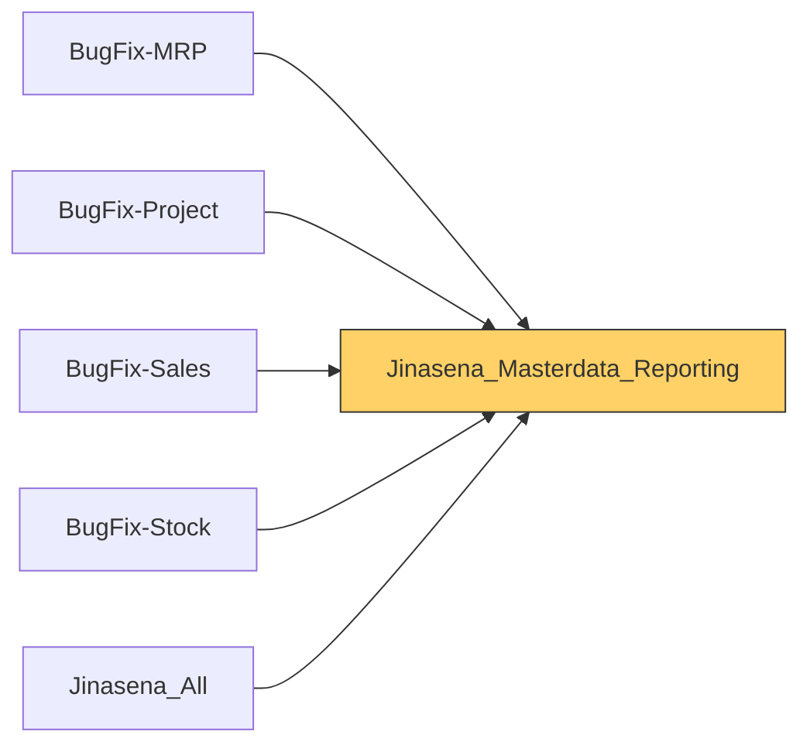

# Functional Documentation — Jinasena_Masterdata_Reporting

> Generated by `scripts/generate_functional_docs.py` from branch `Visual_Migration_02` (commit 3ddc8ae 2026-10-05) and the installed module on the clean environment. For every attribute: **Function** = what it does, **Depends on** = the attributes it relies on (owning module in brackets when it is not this repo), **Used by** = the attributes in any Jinasena repo that rely on it.

| Item | Value |
|---|---|
| Technical name | `Jinasena_Masterdata_Reporting` |
| Title | Jinasena : SubModule : Reporting : Masterdata |
| Version | `17.0.1.0.6` |
| Category | Extra Tools |
| License | LGPL-3 |
| Installed on environment | installed 17.0.1.0.6 |
| History | [CHANGELOG.md](CHANGELOG.md) |

## Purpose

<!-- SUMMARY:repo -->
This module is the shared home of the reporting catalogue used across the Jinasena Odoo installation. It creates the Sales Report Type catalogue and the Sales Report Model records that the Sales, Accounting, Stock and Manufacturing reports all rely on, and it adds report-type link fields on journal entries, journal items, sales order lines, stock moves, product moves and manufacturing orders so those documents can be tagged for a report. It holds no views, automations or report logic of its own: the report forms, the 'SRM' report-generation actions and the actions that fill the links live in BugFix-Accounting, BugFix-Sales, BugFix-Stock and BugFix-MRP, which depend on this module. It replaces earlier duplicate copies of these models in those repos, which had caused a load-order cycle.

- Sales Report Type catalogue: one record per report (name, report code, sequence) with lists of the documents tagged with it.
- Sales Report Model: report instances with period dates, customer and sales-centre filters, project, gross-margin figures and Costing Work Sheet rates, plus read-only lists of tagged documents taken from the report type.
- Report-type link fields on account.move, account.move.line, sale.order.line, stock.move, stock.move.line and mrp.production.
- Full access to both models for internal users.
- Five window actions from the original system were dropped because their target models do not exist on the target environment.
<!-- /SUMMARY -->

## Module dependencies

| Kind | Modules |
|---|---|
| Odoo standard / enterprise | `base_setup`, `account`, `sale`, `stock`, `mrp` |
| Jinasena repos |  |
| Third-party apps |  |
| Used by (Jinasena repos that depend on this one) | `BugFix-MRP`, `BugFix-Project`, `BugFix-Sales`, `BugFix-Stock`, `Jinasena_All` |

## Contents at a glance

| Attribute type | Count |
|---|---|
| Models created | 2 |
| Models extended | 6 |
| Fields | 129 |
| Access rights | 2 |

## Models

| Model | Description | Created / extends | Fields | Views | Actions + automations | Approvals |
|---|---|---|---|---|---|---|
| `account.move` | Journal Entry | extends (account) | 1 | 0 | 0 | 0 |
| `account.move.line` | Journal Item | extends (account) | 2 | 0 | 0 | 0 |
| `mrp.production` | Production Order | extends (mrp) | 1 | 0 | 0 | 0 |
| `sale.order.line` | Sales Order Line | extends (sale) | 1 | 0 | 0 | 0 |
| `stock.move` | Stock Move | extends (stock) | 1 | 0 | 0 | 0 |
| `stock.move.line` | Product Moves (Stock Move Line) | extends (stock) | 3 | 0 | 0 | 0 |
| `x_sales_report_model` | Sales Report Model | created | 77 | 0 | 0 | 0 |
| `x_sales_report_type` | Sales Report Type | created | 43 | 0 | 0 | 0 |

### `account.move` — Journal Entry

*Extends a model created by `account`.* Python: `models/account_move.py`.

Other repos that use this model: `access right BugFix-Accounting.access_6858_account_move` (BugFix-Accounting) `account.bank.statement.line.x_studio_created_from_vendor_bill_1` (BugFix-Accounting) `account.bank.statement.line.x_studio_created_from_vendor_bill` (BugFix-Accounting) `account.bank.statement.line.x_studio_many2one_field_6HjHy` (BugFix-Accounting) `account.bank.statement.line.x_studio_many2one_field_ffAE3` (BugFix-Accounting) `account.bank.statement.line.x_studio_many2one_field_mULOh` (BugFix-Accounting) `account.bank.statement.line.x_studio_many2one_field_xkSx5` (BugFix-Accounting) `account.move._bugfix_purchase_auto_reconcile_cp()` (BugFix-Purchase)

+196 more
`account.move._compute_vendor_bill_1_count()` (BugFix-Accounting) `account.move._compute_vendor_bill_count()` (BugFix-Accounting) `account.move._rug_auto_settle()` (Fix-repair) `account.move.line.x_studio_journal` (BugFix-Accounting) `account.move.x_studio_created_from_vendor_bill_1` (BugFix-Accounting) `account.move.x_studio_created_from_vendor_bill` (BugFix-Accounting) `account.payment.x_studio_created_from_vendor_bill_1` (BugFix-Accounting) `account.payment.x_studio_created_from_vendor_bill` (BugFix-Accounting) `account.payment.x_studio_many2one_field_6HjHy` (BugFix-Accounting) `account.payment.x_studio_many2one_field_ffAE3` (BugFix-Accounting) `account.payment.x_studio_many2one_field_mULOh` (BugFix-Accounting) `account.payment.x_studio_many2one_field_xkSx5` (BugFix-Accounting) `approval rule BugFix-Accounting.ar_final_journal_entry_sls_credit_note_approval_sales_credit_note_app` (BugFix-Accounting) `approval rule BugFix-Accounting.ar_relaxed_journal_entry_sls_overdue_approval_sales_credit_note_approve` (BugFix-Accounting) `automation BugFix-Accounting.automation_115_validate_journals_created_from_cp_npo` (BugFix-Accounting) `automation BugFix-Accounting.automation_121_srm_update_sales_order_customer_invoice` (BugFix-Accounting) `automation BugFix-Accounting.automation_138_supplier_invoice_no_update_in_import_vendor_bill` (BugFix-Accounting) `automation BugFix-Accounting.automation_145_sls_validate_bank_guarantee_in_customer_invoice` (BugFix-Accounting) `automation BugFix-Accounting.automation_170_supplier_invoice_no_update_in_import_vendor_bill_2` (BugFix-Accounting) `automation BugFix-Accounting.automation_215_rr_validate_rug_in_customer_invoice` (BugFix-Accounting) `automation BugFix-Accounting.automation_237_update_analytic_tag_parameters_sales_invoice_customer` (BugFix-Accounting) `automation BugFix-Accounting.automation_328_project_update_project_no_for_manual_transactions` (BugFix-Accounting) `automation BugFix-Accounting.automation_43_work_center_costing_model_update_journal_entries` (BugFix-Accounting) `automation BugFix-Accounting.automation_64_imp_update_consignment_vendor_bill` (BugFix-Accounting) `automation BugFix-Accounting.automation_72_imp_update_lc_status_to_paid` (BugFix-Accounting) `automation BugFix-Accounting.base_automation_115_validate_journals_created_from_cp_npo` (BugFix-Accounting) `automation BugFix-Accounting.base_automation_121_srm_update_sales_order_customer_invoice` (BugFix-Accounting) `automation BugFix-Accounting.base_automation_123_srm_auto_populate_report_type_in_account_move` (BugFix-Accounting) `automation BugFix-Accounting.base_automation_127_sls_validate_payment_in_customer_invoice` (BugFix-Accounting) `automation BugFix-Accounting.base_automation_138_supplier_invoice_no_update_in_import_vendor_bill` (BugFix-Accounting) `automation BugFix-Accounting.base_automation_145_sls_validate_bank_guarantee_in_customer_invoice` (BugFix-Accounting) `automation BugFix-Accounting.base_automation_170_supplier_invoice_no_update_in_import_vendor_bill_2` (BugFix-Accounting) `automation BugFix-Accounting.base_automation_215_rr_validate_rug_in_customer_invoice` (BugFix-Accounting) `automation BugFix-Accounting.base_automation_237_update_analytic_tag_parameters_sales_invoice_customer` (BugFix-Accounting) `automation BugFix-Accounting.base_automation_238_update_analytic_tag_parameters_sales_invoice_user` (BugFix-Accounting) `automation BugFix-Accounting.base_automation_328_project_update_project_no_for_manual_transactions` (BugFix-Accounting) `automation BugFix-Accounting.base_automation_338_pr_validate_cash_issued_in_npo` (BugFix-Accounting) `automation BugFix-Accounting.base_automation_43_work_center_costing_model_update_journal_entries` (BugFix-Accounting) `automation BugFix-Accounting.base_automation_64_imp_update_consignment_vendor_bill` (BugFix-Accounting) `automation BugFix-Accounting.base_automation_72_imp_update_lc_status_to_paid` (BugFix-Accounting) `record rule BugFix-Accounting.rule_142_purchase_user_account_move` (BugFix-Accounting) `record rule BugFix-Accounting.rule_172_personal_invoices` (BugFix-Accounting) `record rule BugFix-Accounting.rule_173_all_invoices` (BugFix-Accounting) `record rule BugFix-Accounting.rule_634_expense_team_approver_account_move` (BugFix-Accounting) `record rule BugFix-Accounting.rule_637_point_of_sale_account_move` (BugFix-Accounting) `record rule BugFix-Accounting.rule_776_invoice_pos_user` (BugFix-Accounting) `record rule BugFix-Accounting.rule_77_account_entry` (BugFix-Accounting) `record rule BugFix-Accounting.rule_93_all_journal_entries` (BugFix-Accounting) `record rule BugFix-Accounting.rule_95_portal_personal_account_invoices` (BugFix-Accounting) `record rule BugFix-Accounting.rule_97_readonly_move` (BugFix-Accounting) `record rule BugFix-Accounting.rule_99_readonly_move` (BugFix-Accounting) `report BugFix-Accounting.action_report_journal_entry_1` (BugFix-Accounting) `report BugFix-Accounting.action_report_journal_entry_2` (BugFix-Accounting) `report BugFix-Accounting.action_report_pro_forma_invoice` (BugFix-Accounting) `sale.order._create_repair_full_invoice()` (Fix-repair) `sale.order.write()` (Fix-repair) `server action BugFix-Accounting.sa_f5_account_move_project_update_project_no_for_manual_transactions` (BugFix-Accounting) `server action BugFix-Accounting.sa_f5_account_move_rr_validate_rug_in_customer_invoice` (BugFix-Accounting) `server action BugFix-Accounting.sa_f5_account_move_sls_validate_bank_guarantee_in_customer_invoice` (BugFix-Accounting) `server action BugFix-Accounting.sa_f5_account_move_sls_validate_payment_in_customer_invoice` (BugFix-Accounting) `server action BugFix-Accounting.sa_f5_account_payment_update_project_no_in_journal_entry` (BugFix-Accounting) `server action BugFix-Accounting.server_action_1144_work_center_costing_model_update_journal_entries` (BugFix-Accounting) `server action BugFix-Accounting.server_action_1368_imp_update_consignment_vendor_bill` (BugFix-Accounting) `server action BugFix-Accounting.server_action_1370_imp_update_consignment_pi` (BugFix-Accounting) `server action BugFix-Accounting.server_action_1374_imp_testing` (BugFix-Accounting) `server action BugFix-Accounting.server_action_1384_imp_post_tp_invoice` (BugFix-Accounting) `server action BugFix-Accounting.server_action_1396_imp_update_consignment_vendor_bill` (BugFix-Accounting) `server action BugFix-Accounting.server_action_1408_imp_update_lc_status_to_paid` (BugFix-Accounting) `server action BugFix-Accounting.server_action_1441_test_22` (BugFix-Accounting) `server action BugFix-Accounting.server_action_1489_sls_request_credit_note_approval_sent` (BugFix-Accounting) `server action BugFix-Accounting.server_action_1491_sls_request_credit_note_approval_notify_user` (BugFix-Accounting) `server action BugFix-Accounting.server_action_1493_sls_request_credit_note_approval` (BugFix-Accounting) `server action BugFix-Accounting.server_action_1495_sls_credit_note_approval_main` (BugFix-Accounting) `server action BugFix-Accounting.server_action_1519_sls_payment_reconciliation_automate` (BugFix-Accounting) `server action BugFix-Accounting.server_action_1720_validate_journals_created_from_cp_npo` (BugFix-Accounting) `server action BugFix-Accounting.server_action_1733_srm_update_sales_order_customer_invoice` (BugFix-Accounting) `server action BugFix-Accounting.server_action_1740_srm_auto_populate_report_type_in_account_move` (BugFix-Accounting) `server action BugFix-Accounting.server_action_1751_sls_validate_payment_in_customer_invoice` (BugFix-Accounting) `server action BugFix-Accounting.server_action_1766_supplier_invoice_no_update_in_import_vendor_bill` (BugFix-Accounting) `server action BugFix-Accounting.server_action_1775_sls_validate_bank_guarantee_in_customer_invoice` (BugFix-Accounting) `server action BugFix-Accounting.server_action_1847_supplier_invoice_no_update_in_import_vendor_bill_2` (BugFix-Accounting) `server action BugFix-Accounting.server_action_1851_sls_send_bank_guarantee_notification_in_customer_invoice` (BugFix-Accounting) `server action BugFix-Accounting.server_action_1852_sls_view_bank_guarantee_validation_in_customer_invoice` (BugFix-Accounting) `server action BugFix-Accounting.server_action_1854_sls_view_credit_limit_validation_in_customer_invoice` (BugFix-Accounting) `server action BugFix-Accounting.server_action_2176_rr_rug_account_update_in_si` (BugFix-Accounting) `server action BugFix-Accounting.server_action_2331_rr_validate_rug_in_customer_invoice` (BugFix-Accounting) `server action BugFix-Accounting.server_action_2366_imp_vendor_bill_currency_rate` (BugFix-Accounting) `server action BugFix-Accounting.server_action_2417_update_analytic_tag_parameters_sales_invoice_customer` (BugFix-Accounting) `server action BugFix-Accounting.server_action_2418_update_analytic_tag_parameters_sales_invoice_user` (BugFix-Accounting) `server action BugFix-Accounting.server_action_2537_sls_credit_note_approval` (BugFix-Accounting) `server action BugFix-Accounting.server_action_2539_sls_credit_note_approval_confirm` (BugFix-Accounting) `server action BugFix-Accounting.server_action_2627_update_project_no_in_journal_entry` (BugFix-Accounting) `server action BugFix-Accounting.server_action_2738_project_update_project_no_for_manual_transactions` (BugFix-Accounting) `server action BugFix-Accounting.server_action_2739_project_update_advance_payment_account` (BugFix-Accounting) `server action BugFix-Accounting.server_action_2762_project_update_advance_payment_account_vendor_bill` (BugFix-Accounting) `server action BugFix-Accounting.server_action_2884_pr_validate_cash_issued_in_npo` (BugFix-Accounting) `server action BugFix-Accounting.srv_advance_payment_acc_update` (BugFix-Accounting) `server action BugFix-Accounting.srv_imp_update_consignment_pi` (BugFix-Accounting) `server action BugFix-Accounting.srv_imp_vendor_bill_currency_rate` (BugFix-Accounting) `server action BugFix-Accounting.srv_rug_account_update_in_si` (BugFix-Accounting) `server action BugFix-Accounting.srv_sls_credit_note_approval_main` (BugFix-Accounting) `server action BugFix-Accounting.srv_sls_credit_note_approved_flag` (BugFix-Accounting) `server action BugFix-Accounting.srv_sls_credit_note_confirm_activity` (BugFix-Accounting) `server action BugFix-Accounting.srv_sls_credit_note_notify_tharaka` (BugFix-Accounting) `server action BugFix-Accounting.srv_sls_credit_note_request_sent_flag` (BugFix-Accounting) `server action BugFix-Accounting.srv_sls_request_credit_note_approval` (BugFix-Accounting) `server action BugFix-Accounting.srv_sls_send_bank_guarantee_notification` (BugFix-Accounting) `server action BugFix-Accounting.srv_sls_view_bank_guarantee_validation` (BugFix-Accounting) `server action BugFix-Accounting.srv_sls_view_credit_limit_validation` (BugFix-Accounting) `server action BugFix-Accounting.srv_tp_invoice_post` (BugFix-Accounting) `server action BugFix-Accounting.srv_update_advance_payment_account_vendor_bill` (BugFix-Accounting) `server action BugFix-Project.server_action_2119_project_update_month_end_entries_2` (BugFix-Project) `server action BugFix-Purchase.action_consignment_vendor_dispatch` (BugFix-Purchase) `server action BugFix-Purchase.server_action_1717_update_actual_spent_in_cash_purchase` (BugFix-Purchase) `server action BugFix-Purchase.server_action_899_cash_purchase_cash_issued` (BugFix-Purchase) `server action BugFix-Purchase.server_action_917_cash_purchase_cash_settled` (BugFix-Purchase) `server action BugFix-Purchase.server_action_988_npo_invoice_journal` (BugFix-Purchase) `server action BugFix-Stock.server_action_1138_work_center_costing_model_create_journal_entries` (BugFix-Stock) `server action BugFix-Stock.server_action_1305_imp_consignment_vendor_despatch` (BugFix-Stock) `server action BugFix-Stock.server_action_1321_imp_consignment_custom_duty` (BugFix-Stock) `server action BugFix-Stock.server_action_1358_imp_update_consignment` (BugFix-Stock) `server action BugFix-Stock.server_action_2118_project_update_month_end_entries` (BugFix-Stock) `server action BugFix-Stock.server_action_2448_movement_journals_update_offset_account` (BugFix-Stock) `server action BugFix-Stock.server_action_2566_work_center_costing_model_create_journal_entries_original` (BugFix-Stock) `server action BugFix-Stock.server_action_3647_consignment_vendor_dispatch_bugfix_purchase` (BugFix-Stock) `server action BugFix-Studio-Misc.server_action_2799_mst_odoo_data_clean_up` (BugFix-Studio-Misc) `server action BugFix-Studio-Misc.server_action_2831_mst_odoo_data_clean_up_001` (BugFix-Studio-Misc) `server action BugFix-Studio-Misc.server_action_2883_mst_odoo_data_clean_up_004` (BugFix-Studio-Misc) `window action BugFix-Accounting.act_custom_clearance_reversal` (BugFix-Accounting) `window action BugFix-Accounting.act_dispatch_reversal` (BugFix-Accounting) `window action BugFix-Accounting.act_tp_invoice_vendor_bill` (BugFix-Accounting) `window action BugFix-Accounting.act_window_1306_vendor_despatch` (BugFix-Accounting) `window action BugFix-Accounting.act_window_1322_custom_clearance` (BugFix-Accounting) `window action BugFix-Accounting.act_window_1362_vend_dispatch_reversal` (BugFix-Accounting) `window action BugFix-Accounting.act_window_1363_custom_clearance_reversal` (BugFix-Accounting) `window action BugFix-Accounting.act_window_1371_dispatch_reversal` (BugFix-Accounting) `window action BugFix-Accounting.act_window_1372_custom_clearance_reversal` (BugFix-Accounting) `window action BugFix-Accounting.act_window_1385_vendor_bill` (BugFix-Accounting) `window action BugFix-Accounting.act_window_1386_vendor_bill` (BugFix-Accounting) `window action BugFix-Accounting.act_window_1569_invoices` (BugFix-Accounting) `window action BugFix-Accounting.act_window_1571_sales_invoice_lines` (BugFix-Accounting) `window action BugFix-Accounting.act_window_2120_month_end_entries` (BugFix-Accounting) `window action BugFix-Accounting.act_window_2628_account_move` (BugFix-Accounting) `window action BugFix-Accounting.act_window_2630_journal_entries` (BugFix-Accounting) `window action BugFix-Accounting.act_window_2734_cash_advance_bills` (BugFix-Accounting) `window action BugFix-Accounting.act_window_2735_issued_cash_advances` (BugFix-Accounting) `window action BugFix-Accounting.act_window_2736_settled_cash_advances` (BugFix-Accounting) `window action BugFix-Accounting.act_window_3268_invoice_wise_revenue_report` (BugFix-Accounting) `window action BugFix-Accounting.act_window_900_cash_issued` (BugFix-Accounting) `window action BugFix-Accounting.act_window_989_related_invoice_journal` (BugFix-Accounting) `window action BugFix-Accounting.action_1306_vendor_despatch` (BugFix-Accounting) `window action BugFix-Accounting.action_1322_custom_clearance` (BugFix-Accounting) `window action BugFix-Accounting.action_1362_vend_dispatch_reversal` (BugFix-Accounting) `window action BugFix-Accounting.action_1363_custom_clearance_reversal` (BugFix-Accounting) `window action BugFix-Accounting.action_1371_dispatch_reversal` (BugFix-Accounting) `window action BugFix-Accounting.action_1372_custom_clearance_reversal` (BugFix-Accounting) `window action BugFix-Accounting.action_1385_vendor_bill` (BugFix-Accounting) `window action BugFix-Accounting.action_1386_vendor_bill` (BugFix-Accounting) `window action BugFix-Accounting.action_1569_invoices` (BugFix-Accounting) `window action BugFix-Accounting.action_1571_sales_invoice_lines` (BugFix-Accounting) `window action BugFix-Accounting.action_2120_month_end_entries` (BugFix-Accounting) `window action BugFix-Accounting.action_2628_account_move` (BugFix-Accounting) `window action BugFix-Accounting.action_2630_journal_entries` (BugFix-Accounting) `window action BugFix-Accounting.action_2734_cash_advance_bills` (BugFix-Accounting) `window action BugFix-Accounting.action_2735_issued_cash_advances` (BugFix-Accounting) `window action BugFix-Accounting.action_2736_settled_cash_advances` (BugFix-Accounting) `window action BugFix-Accounting.action_3268_invoice_wise_revenue_report` (BugFix-Accounting) `window action BugFix-Accounting.action_900_cash_issued` (BugFix-Accounting) `window action BugFix-Accounting.action_989_related_invoice_journal` (BugFix-Accounting) `window action BugFix-Accounting.aw_f4_account_move_account_move` (BugFix-Accounting) `window action BugFix-Accounting.aw_f4_account_move_cash_advance_bills` (BugFix-Accounting) `window action BugFix-Accounting.aw_f4_account_move_cash_issued` (BugFix-Accounting) `window action BugFix-Accounting.aw_f4_account_move_custom_clearance_reversal` (BugFix-Accounting) `window action BugFix-Accounting.aw_f4_account_move_custom_clearance` (BugFix-Accounting) `window action BugFix-Accounting.aw_f4_account_move_dispatch_reversal` (BugFix-Accounting) `window action BugFix-Accounting.aw_f4_account_move_invoice_wise_revenue_report` (BugFix-Accounting) `window action BugFix-Accounting.aw_f4_account_move_invoices` (BugFix-Accounting) `window action BugFix-Accounting.aw_f4_account_move_issued_cash_advances` (BugFix-Accounting) `window action BugFix-Accounting.aw_f4_account_move_journal_entries` (BugFix-Accounting) `window action BugFix-Accounting.aw_f4_account_move_month_end_entries` (BugFix-Accounting) `window action BugFix-Accounting.aw_f4_account_move_related_invoice_journal` (BugFix-Accounting) `window action BugFix-Accounting.aw_f4_account_move_sales_invoice_lines` (BugFix-Accounting) `window action BugFix-Accounting.aw_f4_account_move_settled_cash_advances` (BugFix-Accounting) `window action BugFix-Accounting.aw_f4_account_move_vend_dispatch_reversal` (BugFix-Accounting) `window action BugFix-Accounting.aw_f4_account_move_vendor_bill` (BugFix-Accounting) `window action BugFix-Accounting.aw_f4_account_move_vendor_despatch` (BugFix-Accounting) `window action BugFix-Stock.act_1306_vendor_despatch` (BugFix-Stock) `window action BugFix-Stock.act_1322_custom_clearance` (BugFix-Stock) `window action BugFix-Stock.act_1362_vend_dispatch_reversal` (BugFix-Stock) `window action BugFix-Stock.act_1363_custom_clearance_reversal` (BugFix-Stock) `x_po_non_inventory._compute_related_account_move_count()` (BugFix-Purchase) `x_product_test.x_studio_many2one_field_wTxgi` (BugFix-Studio-Misc) `x_purchase_request_cas._compute_related_account_move_count()` (BugFix-Purchase) `x_rm_gross_margin_invo.x_studio_invoice_no` (BugFix-Accounting) `x_rm_sales_order_line.x_studio_invoice` (BugFix-Accounting) `x_tp_invoice_header._compute_x_x_studio_tp_id__account_move_count()` (BugFix-Accounting)

**Summary:**

<!-- SUMMARY:model:account.move -->
This repo adds one field, Report Type (S - Cust Aging), which links a journal entry to the Sales Report Type for the Customer Aging report. It is the inverse of the report type's Journal Entry Id list and is filled by the 'SRM Auto Populate Report Type in Account Move' server action in BugFix-Accounting. No views, buttons or automations are added here.
<!-- /SUMMARY -->

**Fields (1):**

| Field | Label | Type | Function | How it gets its value | Depends on | Used by |
|---|---|---|---|---|---|---|
| `x_studio_report_type_s_cust_aging` | Report Type (S - Cust Aging) | many2one → `x_sales_report_type` | Links the journal entry to the Sales Report Type used for the Customer Aging report; filled automatically by the 'SRM Auto Populate Report Type in Account Move' server action and shown in Studio account views. Inverse of the report type's Journal Entry Id list. | stored | `model x_sales_report_type` | `account.payment.x_studio_report_type_s_cust_aging` `server action BugFix-Accounting.server_action_1740_srm_auto_populate_report_type_in_account_move` (BugFix-Accounting) `view BugFix-Accounting.ported_view_2440_odoo_studio_account_05b91b49_9dd1_4362_a49e_835596bd7ace` (BugFix-Accounting) `view BugFix-Accounting.ported_view_3906_odoo_studio_account_3d938809_4b3e_4ad9_aff4_9c2a2e2b0eb5` (BugFix-Accounting) |

### `account.move.line` — Journal Item

*Extends a model created by `account`.* Python: `models/account_move_line.py`.

Other repos that use this model: `access right BugFix-Accounting.access_6867_account_move_line` (BugFix-Accounting) `account.move._bugfix_purchase_auto_reconcile_cp()` (BugFix-Purchase) `account.move.line._compute_x_studio_employers_contribution()` (BugFix-Accounting) `account.move.line._compute_x_studio_members_contribution()` (BugFix-Accounting) `automation BugFix-Accounting.base_automation_120_srm_auto_populate_report_type_in_account_move_lines` (BugFix-Accounting) `automation BugFix-Accounting.base_automation_219_update_analytic_tag_parameters_sales_invoice_line_product` (BugFix-Accounting) `automation BugFix-Accounting.base_automation_239_update_analytic_tag_parameters_sales_invoice_line_account` (BugFix-Accounting) `automation BugFix-Accounting.base_automation_343_etf_schedule_contract_id` (BugFix-Accounting)

+81 more
`record rule BugFix-Accounting.rule_100_readonly_move_line` (BugFix-Accounting) `record rule BugFix-Accounting.rule_141_purchase_user_account_move_line` (BugFix-Accounting) `record rule BugFix-Accounting.rule_174_personal_invoice_lines` (BugFix-Accounting) `record rule BugFix-Accounting.rule_175_all_invoice_lines` (BugFix-Accounting) `record rule BugFix-Accounting.rule_329_expense_team_approver_account_move_line` (BugFix-Accounting) `record rule BugFix-Accounting.rule_636_point_of_sale_account_move_line` (BugFix-Accounting) `record rule BugFix-Accounting.rule_78_entry_lines` (BugFix-Accounting) `record rule BugFix-Accounting.rule_94_all_journal_items` (BugFix-Accounting) `record rule BugFix-Accounting.rule_96_portal_invoice_lines` (BugFix-Accounting) `record rule BugFix-Accounting.rule_98_readonly_move_line` (BugFix-Accounting) `server action BugFix-Accounting.sa_f5_x_sales_report_model_srm_rpt_costing_work_sheet` (BugFix-Accounting) `server action BugFix-Accounting.sa_f5_x_sales_report_model_srm_rpt_project_gross_margin` (BugFix-Accounting) `server action BugFix-Accounting.server_action_1144_work_center_costing_model_update_journal_entries` (BugFix-Accounting) `server action BugFix-Accounting.server_action_1370_imp_update_consignment_pi` (BugFix-Accounting) `server action BugFix-Accounting.server_action_1374_imp_testing` (BugFix-Accounting) `server action BugFix-Accounting.server_action_1670_rpt_daily_sales_report_generate` (BugFix-Accounting) `server action BugFix-Accounting.server_action_1680_rpt_customer_wise_invoices_generate` (BugFix-Accounting) `server action BugFix-Accounting.server_action_1732_srm_auto_populate_report_type_in_account_move_lines` (BugFix-Accounting) `server action BugFix-Accounting.server_action_2102_srm_rpt_project_gross_margin` (BugFix-Accounting) `server action BugFix-Accounting.server_action_2176_rr_rug_account_update_in_si` (BugFix-Accounting) `server action BugFix-Accounting.server_action_2344_update_analytic_tag_parameters_sales_invoice_line_product` (BugFix-Accounting) `server action BugFix-Accounting.server_action_2366_imp_vendor_bill_currency_rate` (BugFix-Accounting) `server action BugFix-Accounting.server_action_2419_update_analytic_tag_parameters_sales_invoice_line_account` (BugFix-Accounting) `server action BugFix-Accounting.server_action_2490_srm_rpt_costing_work_sheet` (BugFix-Accounting) `server action BugFix-Accounting.server_action_2739_project_update_advance_payment_account` (BugFix-Accounting) `server action BugFix-Accounting.server_action_2762_project_update_advance_payment_account_vendor_bill` (BugFix-Accounting) `server action BugFix-Accounting.server_action_3278_execute_code` (BugFix-Accounting) `server action BugFix-Accounting.srv_advance_payment_acc_update` (BugFix-Accounting) `server action BugFix-Accounting.srv_imp_update_consignment_pi` (BugFix-Accounting) `server action BugFix-Accounting.srv_imp_vendor_bill_currency_rate` (BugFix-Accounting) `server action BugFix-Accounting.srv_rug_account_update_in_si` (BugFix-Accounting) `server action BugFix-Accounting.srv_update_advance_payment_account_vendor_bill` (BugFix-Accounting) `server action BugFix-Stock.server_action_1377_imp_copy_charges_to_tp_invoice` (BugFix-Stock) `server action BugFix-Stock.server_action_2448_movement_journals_update_offset_account` (BugFix-Stock) `server action BugFix-Studio-Misc.server_action_2799_mst_odoo_data_clean_up` (BugFix-Studio-Misc) `server action BugFix-Studio-Misc.server_action_2883_mst_odoo_data_clean_up_004` (BugFix-Studio-Misc) `window action BugFix-Accounting.act_window_1145_account_move_line` (BugFix-Accounting) `window action BugFix-Accounting.act_window_1572_sales_invoice_lines` (BugFix-Accounting) `window action BugFix-Accounting.act_window_2198_sales_invoices` (BugFix-Accounting) `window action BugFix-Accounting.act_window_2278_pump_price_costing` (BugFix-Accounting) `window action BugFix-Accounting.act_window_2285_pump_product_costing` (BugFix-Accounting) `window action BugFix-Accounting.act_window_2371_journal_item` (BugFix-Accounting) `window action BugFix-Accounting.act_window_2377_journal_item_2` (BugFix-Accounting) `window action BugFix-Accounting.act_window_2378_journal_item_testing` (BugFix-Accounting) `window action BugFix-Accounting.act_window_2379_journal_item_testing_02` (BugFix-Accounting) `window action BugFix-Accounting.act_window_2530_aaaa` (BugFix-Accounting) `window action BugFix-Accounting.act_window_2631_journal_items` (BugFix-Accounting) `window action BugFix-Accounting.act_window_2737_all_journal_items` (BugFix-Accounting) `window action BugFix-Accounting.act_window_2893_etf_schedule` (BugFix-Accounting) `window action BugFix-Accounting.act_window_2894_epf_schedule` (BugFix-Accounting) `window action BugFix-Accounting.act_window_3271_invoice_wise_revenue_report` (BugFix-Accounting) `window action BugFix-Accounting.action_1145_account_move_line` (BugFix-Accounting) `window action BugFix-Accounting.action_1572_sales_invoice_lines` (BugFix-Accounting) `window action BugFix-Accounting.action_2198_sales_invoices` (BugFix-Accounting) `window action BugFix-Accounting.action_2278_pump_price_costing` (BugFix-Accounting) `window action BugFix-Accounting.action_2285_pump_product_costing` (BugFix-Accounting) `window action BugFix-Accounting.action_2371_journal_item` (BugFix-Accounting) `window action BugFix-Accounting.action_2377_journal_item_2` (BugFix-Accounting) `window action BugFix-Accounting.action_2378_journal_item_testing` (BugFix-Accounting) `window action BugFix-Accounting.action_2379_journal_item_testing_02` (BugFix-Accounting) `window action BugFix-Accounting.action_2530_aaaa` (BugFix-Accounting) `window action BugFix-Accounting.action_2631_journal_items` (BugFix-Accounting) `window action BugFix-Accounting.action_2737_all_journal_items` (BugFix-Accounting) `window action BugFix-Accounting.action_2893_etf_schedule` (BugFix-Accounting) `window action BugFix-Accounting.action_2894_epf_schedule` (BugFix-Accounting) `window action BugFix-Accounting.action_3271_invoice_wise_revenue_report` (BugFix-Accounting) `window action BugFix-Accounting.aw_f4_account_move_line_aaaa` (BugFix-Accounting) `window action BugFix-Accounting.aw_f4_account_move_line_account_move_line` (BugFix-Accounting) `window action BugFix-Accounting.aw_f4_account_move_line_all_journal_items` (BugFix-Accounting) `window action BugFix-Accounting.aw_f4_account_move_line_epf_schedule` (BugFix-Accounting) `window action BugFix-Accounting.aw_f4_account_move_line_etf_schedule` (BugFix-Accounting) `window action BugFix-Accounting.aw_f4_account_move_line_invoice_wise_revenue_report` (BugFix-Accounting) `window action BugFix-Accounting.aw_f4_account_move_line_journal_item_2` (BugFix-Accounting) `window action BugFix-Accounting.aw_f4_account_move_line_journal_item_testing_02` (BugFix-Accounting) `window action BugFix-Accounting.aw_f4_account_move_line_journal_item_testing` (BugFix-Accounting) `window action BugFix-Accounting.aw_f4_account_move_line_journal_item` (BugFix-Accounting) `window action BugFix-Accounting.aw_f4_account_move_line_journal_items` (BugFix-Accounting) `window action BugFix-Accounting.aw_f4_account_move_line_pump_price_costing` (BugFix-Accounting) `window action BugFix-Accounting.aw_f4_account_move_line_pump_product_costing` (BugFix-Accounting) `window action BugFix-Accounting.aw_f4_account_move_line_sales_invoice_lines` (BugFix-Accounting) `window action BugFix-Accounting.aw_f4_account_move_line_sales_invoices` (BugFix-Accounting)

**Summary:**

<!-- SUMMARY:model:account.move.line -->
This repo adds two Sales Report Type links on journal items. Report Type (S- Incentive Calculation) tags the line for the Sales Incentive Calculation report and is filled by the 'SRM Auto Populate Report Type in Account Move Lines' server action in BugFix-Accounting. The second field, Sales Report Type, is the inverse of the report type's 'test' list, appears only in a Studio view and is not filled by any action.
<!-- /SUMMARY -->

**Fields (2):**

| Field | Label | Type | Function | How it gets its value | Depends on | Used by |
|---|---|---|---|---|---|---|
| `x_studio_many2one_field_kiSUJ` | Sales Report Type | many2one → `x_sales_report_type` | Second Sales Report Type link on journal items, shown in a Studio journal-item view; no server action populates it. Inverse of the report type's 'test' One2many. | stored | `model x_sales_report_type` | `view BugFix-Accounting.ported_view_3844_odoo_studio_account_8ae47aec_f33a_4a3d_b767_05cea96ec229` (BugFix-Accounting) |
| `x_studio_sales_report_type` | Report Type (S- Incentive Calculation) | many2one → `x_sales_report_type` | Links the journal item to the Sales Report Type used for the Sales Incentive Calculation report; filled automatically by the 'SRM Auto Populate Report Type in Account Move Lines' server action. Inverse of the report type's Journal Items Id list. | stored | `model x_sales_report_type` | `server action BugFix-Accounting.server_action_1732_srm_auto_populate_report_type_in_account_move_lines` (BugFix-Accounting) `view BugFix-Accounting.ported_view_3844_odoo_studio_account_8ae47aec_f33a_4a3d_b767_05cea96ec229` (BugFix-Accounting) |

### `mrp.production` — Production Order

*Extends a model created by `mrp`.* Python: `models/mrp_production.py`.

Other repos that use this model: `access right BugFix-MRP.access_5656_administrator___kapila` (BugFix-MRP) `approval rule BugFix-Approvals.rule_100_production_order_action_generate_serial_manufacturing_admini` (BugFix-Approvals) `approval rule BugFix-Approvals.rule_101_production_order_action_product_forecast_report_inventory_ji` (BugFix-Approvals) `approval rule BugFix-Approvals.rule_1_production_order_button_unplan_user_types_internal_user_1` (BugFix-Approvals) `approval rule BugFix-Approvals.rule_2_production_order_button_mark_done_user_types_internal_user_2` (BugFix-Approvals) `approval rule BugFix-Approvals.rule_3_production_order_button_mark_done_user_types_internal_user_3` (BugFix-Approvals) `approval rule BugFix-Approvals.rule_4_production_order_button_mark_done_user_types_internal_user_4` (BugFix-Approvals) `approval rule BugFix-Approvals.rule_5_production_order_button_mark_done_manufacturing_administrato` (BugFix-Approvals)

+40 more
`approval rule BugFix-Approvals.rule_91_production_order_button_unbuild_manufacturing_jin_manufactur` (BugFix-Approvals) `approval rule BugFix-Approvals.rule_92_production_order_button_scrap_manufacturing_jin_manufacturin` (BugFix-Approvals) `approval rule BugFix-MRP.approval_rule_107_unlock_production_order` (BugFix-MRP) `approval rule BugFix-MRP.approval_rule_108_cancel_production_order` (BugFix-MRP) `automation BugFix-MRP.automation_122_srm_auto_populate_report_type_in_production_order` (BugFix-MRP) `automation BugFix-MRP.automation_330_proj_mark_as_done_validation` (BugFix-MRP) `automation BugFix-MRP.automation_47_update_original_mo_in_mo` (BugFix-MRP) `automation BugFix-MRP.base_automation_46_update_tracking_item_status_in_mo` (BugFix-MRP) `record rule BugFix-MRP.rule_201_mrp_production_multi_company` (BugFix-MRP) `sale.order.line.x_studio_many2one_field_btM1W` (BugFix-Sales) `server action BugFix-Accounting.sa_f5_x_sales_report_model_srm_rpt_costing_work_sheet` (BugFix-Accounting) `server action BugFix-Accounting.sa_f5_x_sales_report_model_srm_rpt_sales_production_purchase_report` (BugFix-Accounting) `server action BugFix-Accounting.server_action_1144_work_center_costing_model_update_journal_entries` (BugFix-Accounting) `server action BugFix-Accounting.server_action_1519_sls_payment_reconciliation_automate` (BugFix-Accounting) `server action BugFix-Accounting.server_action_1726_srm_auto_populate_data` (BugFix-Accounting) `server action BugFix-Accounting.server_action_1763_srm_rpt_sales_production_purchase_report` (BugFix-Accounting) `server action BugFix-Accounting.server_action_2490_srm_rpt_costing_work_sheet` (BugFix-Accounting) `server action BugFix-MRP.sa_f5_mrp_production_proj_mark_as_done_validation` (BugFix-MRP) `server action BugFix-MRP.server_action_1147_mass_produce_serial_numbers` (BugFix-MRP) `server action BugFix-MRP.server_action_1151_mass_produce_serial_numbers_create_original` (BugFix-MRP) `server action BugFix-MRP.server_action_1154_update_tracking_item_status_in_mo` (BugFix-MRP) `server action BugFix-MRP.server_action_1155_update_original_mo_in_mo` (BugFix-MRP) `server action BugFix-MRP.server_action_1156_assign_original_mo_to_work_order` (BugFix-MRP) `server action BugFix-MRP.server_action_1738_srm_auto_populate_report_type_in_production_order` (BugFix-MRP) `server action BugFix-MRP.server_action_2534_finished_products_location_updated` (BugFix-MRP) `server action BugFix-MRP.server_action_2765_proj_mark_as_done_validation` (BugFix-MRP) `server action BugFix-MRP.server_action_3202_mass_produce_serial_numbers_cancel_serial_no` (BugFix-MRP) `server action BugFix-Stock.server_action_1138_work_center_costing_model_create_journal_entries` (BugFix-Stock) `server action BugFix-Stock.server_action_2566_work_center_costing_model_create_journal_entries_original` (BugFix-Stock) `server action BugFix-Studio-Misc.server_action_2799_mst_odoo_data_clean_up` (BugFix-Studio-Misc) `server action BugFix-Studio-Misc.server_action_2883_mst_odoo_data_clean_up_004` (BugFix-Studio-Misc) `stock.lot.x_studio_production_id` (BugFix-Stock) `x_mass_produce_serial.x_studio_production_id` (BugFix-MRP) `x_mass_produce_serial_.x_studio_production_id` (BugFix-MRP) `x_mrp_bom_general_cost.x_studio_prod_bom_general_cost_ids` (BugFix-MRP) `x_mrp_bom_labour_cost.x_studio_prod_bom_labour_cost_ids` (BugFix-MRP) `x_mrp_bom_material_cos.x_studio_prod_bom_material_cost_ids` (BugFix-MRP) `x_mrp_bom_overhead_cos.x_studio_prod_bom_overhead_cost_ids` (BugFix-MRP) `x_rm_production_orders.x_studio_production_id` (BugFix-Accounting) `x_rm_production_varian.x_studio_production_id` (BugFix-Accounting)

**Summary:**

<!-- SUMMARY:model:mrp.production -->
This repo adds Report Type (M-WIP), which links a manufacturing order to the Sales Report Type for the Production Overview (WIP) report. It is filled by the 'SRM Auto Populate Report Type in Production Order' server action and shown in the production list view, both in BugFix-MRP.
<!-- /SUMMARY -->

**Fields (1):**

| Field | Label | Type | Function | How it gets its value | Depends on | Used by |
|---|---|---|---|---|---|---|
| `x_studio_report_type_m_wip` | Report Type (M-WIP) | many2one → `x_sales_report_type` | Links the manufacturing order to the Sales Report Type for the Production Overview (WIP) report; filled by the 'SRM Auto Populate Report Type in Production Order' server action and shown in the production list view. | stored | `model x_sales_report_type` | `server action BugFix-MRP.server_action_1738_srm_auto_populate_report_type_in_production_order` (BugFix-MRP) `view BugFix-MRP.ported_view_2390_mrp_production_tree` (BugFix-MRP) |

### `sale.order.line` — Sales Order Line

*Extends a model created by `sale`.* Python: `models/sale_order_line.py`.

Other repos that use this model: `access right BugFix-Analytics.access_6247_inv___administrator` (BugFix-Analytics) `access right BugFix-Analytics.access_7003_sales_order_lines` (BugFix-Analytics) `automation BugFix-Sales.base_automation_118_srm_auto_populate_report_type_in_so_lines` (BugFix-Sales) `automation BugFix-Sales.base_automation_193_rr_sales_price_for_rug_items` (BugFix-Sales) `automation BugFix-Sales.base_automation_196_proj_item_related_details_in_project_so` (BugFix-Sales) `automation BugFix-Sales.base_automation_204_rr_track_lock_status_3` (BugFix-Sales) `automation BugFix-Sales.base_automation_212_sls_apply_pricelist_in_so_lines` (BugFix-Sales) `automation BugFix-Sales.base_automation_216_sls_clear_free_items_so_lines` (BugFix-Sales)

+56 more
`automation BugFix-Sales.base_automation_236_update_analytic_tag_parameters_sales_line_product` (BugFix-Sales) `automation BugFix-Sales.base_automation_342_proj_update_price_confirmed_status` (BugFix-Sales) `automation BugFix-Sales.base_automation_89_sls_validate_discount_in_so_line` (BugFix-Sales) `automation BugFix-Sales.base_automation_90_sls_validate_commission_in_so_line` (BugFix-Sales) `automation BugFix-Sales.base_automation_91_sls_validate_margin_in_so_line` (BugFix-Sales) `helpdesk.ticket._compute_x_studio_task_status()` (Fix-repair) `helpdesk.ticket._compute_x_studio_valid_delivered_so()` (Fix-repair) `record rule BugFix-Analytics.rule_158_sales_order_line_multi_company` (BugFix-Analytics) `record rule BugFix-Analytics.rule_163_portal_sales_orders_line` (BugFix-Analytics) `record rule BugFix-Analytics.rule_168_personal_order_lines` (BugFix-Analytics) `record rule BugFix-Analytics.rule_169_all_orders_lines` (BugFix-Analytics) `record rule BugFix-Analytics.rule_419_sale_planning_planning_admin_can_see_every_service_sol` (BugFix-Analytics) `record rule BugFix-Sales.rule_190_project_manager_sales_orders_line` (BugFix-Sales) `report BugFix-Studio-Misc.action_report_1596_sales_order_lines` (BugFix-Studio-Misc) `sale.order._fix_repair_apply_track_lock_status()` (Fix-repair) `sale.order.x_studio_one2many_field_ERCBB` (BugFix-Sales) `server action BugFix-Accounting.sa_f5_x_sales_report_model_srm_rpt_project_gross_margin` (BugFix-Accounting) `server action BugFix-Accounting.sa_f5_x_sales_report_model_srm_rpt_sales_production_purchase_report` (BugFix-Accounting) `server action BugFix-Accounting.server_action_1726_srm_auto_populate_data` (BugFix-Accounting) `server action BugFix-Accounting.server_action_1763_srm_rpt_sales_production_purchase_report` (BugFix-Accounting) `server action BugFix-Accounting.server_action_2102_srm_rpt_project_gross_margin` (BugFix-Accounting) `server action BugFix-Sales.sa_f5_sale_order_line_proj_update_price_confirmed_status` (BugFix-Sales) `server action BugFix-Sales.sa_f5_sale_order_line_rr_sales_price_for_rug_items` (BugFix-Sales) `server action BugFix-Sales.sa_f5_sale_order_line_rr_track_lock_status_3` (BugFix-Sales) `server action BugFix-Sales.sa_f5_sale_order_rr_track_lock_status` (BugFix-Sales) `server action BugFix-Sales.server_action_1497_sls_validate_discount_in_so_line` (BugFix-Sales) `server action BugFix-Sales.server_action_1498_sls_validate_commission_in_so_line` (BugFix-Sales) `server action BugFix-Sales.server_action_1508_sls_validate_margin_in_so_line` (BugFix-Sales) `server action BugFix-Sales.server_action_1729_srm_auto_populate_report_type_in_so_lines` (BugFix-Sales) `server action BugFix-Sales.server_action_1840_sls_validate_sos_without_lines` (BugFix-Sales) `server action BugFix-Sales.server_action_1841_sls_overdue_approval_request_sent_validate` (BugFix-Sales) `server action BugFix-Sales.server_action_1843_sls_request_approval_sent_validate` (BugFix-Sales) `server action BugFix-Sales.server_action_1845_sls_request_bank_guarantee_approval_sent_validate` (BugFix-Sales) `server action BugFix-Sales.server_action_2096_rr_insufficient_transfer_inventory_details` (BugFix-Sales) `server action BugFix-Sales.server_action_2144_rr_sales_price_for_rug_items` (BugFix-Sales) `server action BugFix-Sales.server_action_2162_proj_item_related_details_in_project_so` (BugFix-Sales) `server action BugFix-Sales.server_action_2250_rr_track_lock_status` (BugFix-Sales) `server action BugFix-Sales.server_action_2252_rr_track_lock_status_3` (BugFix-Sales) `server action BugFix-Sales.server_action_2253_rr_track_lock_status_4` (BugFix-Sales) `server action BugFix-Sales.server_action_2314_sls_apply_pricelist_in_so_lines` (BugFix-Sales) `server action BugFix-Sales.server_action_2315_sls_apply_pricelist_in_so_lines` (BugFix-Sales) `server action BugFix-Sales.server_action_2332_sls_clear_free_items_so_lines` (BugFix-Sales) `server action BugFix-Sales.server_action_2337_sls_validate_sales` (BugFix-Sales) `server action BugFix-Sales.server_action_2416_update_analytic_tag_parameters_sales_line_product` (BugFix-Sales) `server action BugFix-Sales.server_action_2898_proj_update_price_confirmed_status` (BugFix-Sales) `server action BugFix-Studio-Misc.server_action_2268_sample_server_action_2` (BugFix-Studio-Misc) `window action BugFix-Sales.act_window_1568_sales_order_lines` (BugFix-Sales) `window action BugFix-Sales.act_window_2193_line_items` (BugFix-Sales) `window action BugFix-Sales.act_window_2194_line_items` (BugFix-Sales) `window action BugFix-Sales.act_window_2195_line_items` (BugFix-Sales) `window action BugFix-Sales.act_window_2200_sales_production_request_status` (BugFix-Sales) `window action BugFix-Sales.aw_f4_sale_order_line_line_items` (BugFix-Sales) `window action BugFix-Sales.aw_f4_sale_order_line_sales_order_lines` (BugFix-Sales) `window action BugFix-Sales.aw_f4_sale_order_line_sales_production_request_status` (BugFix-Sales) `x_purchase_request_lin.x_studio_sales_line_id` (BugFix-Purchase) `x_temp_estimated.x_studio_sales_order_line_id` (BugFix-Accounting)

**Summary:**

<!-- SUMMARY:model:sale.order.line -->
This repo adds a Sales Report Type link on sales order lines so the lines can be pulled into sales reports. It is filled by the 'SRM Auto Populate Report Type in SO Lines' server action in BugFix-Sales and is the inverse of the report type's Sales Lines Id list.
<!-- /SUMMARY -->

**Fields (1):**

| Field | Label | Type | Function | How it gets its value | Depends on | Used by |
|---|---|---|---|---|---|---|
| `x_studio_sales_report_type` | Sales Report Type | many2one → `x_sales_report_type` | Links the sales order line to a Sales Report Type; filled automatically by the 'SRM Auto Populate Report Type in SO Lines' server action so the line can be pulled into sales reports. Inverse of the report type's Sales Lines Id list. | stored | `model x_sales_report_type` | `server action BugFix-Sales.server_action_1729_srm_auto_populate_report_type_in_so_lines` (BugFix-Sales) |

### `stock.move` — Stock Move

*Extends a model created by `stock`.* Python: `models/stock_move.py`.

Other repos that use this model: `access right BugFix-Stock.access_6088_user` (BugFix-Stock) `access right BugFix-Stock.access_6853_stock_move` (BugFix-Stock) `access right BugFix-Stock.access_7004_stock_move` (BugFix-Stock) `automation BugFix-Stock.base_automation_129_srm_auto_populate_report_type_in_product_variance_moves` (BugFix-Stock) `automation BugFix-Stock.base_automation_130_srm_production_job_variance_write_original` (BugFix-Stock) `automation BugFix-Stock.base_automation_28_create_production_bom_material_cost` (BugFix-Stock) `automation BugFix-Stock.base_automation_29_update_production_bom_material_cost` (BugFix-Stock) `helpdesk.ticket._repair_studio_auto_create_repair_route()` (Fix-repair)

+25 more
`helpdesk.ticket._repair_studio_auto_create_repair_serial_nos()` (Fix-repair) `record rule BugFix-Stock.rule_50_stock_move_multi_company` (BugFix-Stock) `server action BugFix-Accounting.server_action_1144_work_center_costing_model_update_journal_entries` (BugFix-Accounting) `server action BugFix-Accounting.server_action_1519_sls_payment_reconciliation_automate` (BugFix-Accounting) `server action BugFix-Purchase.server_action_2406_create_material_transfer` (BugFix-Purchase) `server action BugFix-Stock.server_action_1058_create_production_bom_material_cost` (BugFix-Stock) `server action BugFix-Stock.server_action_1066_create_production_bom_material_cost` (BugFix-Stock) `server action BugFix-Stock.server_action_1073_update_production_bom_material_cost` (BugFix-Stock) `server action BugFix-Stock.server_action_1138_work_center_costing_model_create_journal_entries` (BugFix-Stock) `server action BugFix-Stock.server_action_1755_srm_auto_populate_report_type_in_product_variance_moves` (BugFix-Stock) `server action BugFix-Stock.server_action_1758_srm_production_job_variance_write_original` (BugFix-Stock) `server action BugFix-Stock.server_action_1997_rr_rug_return_from_help_desk` (BugFix-Stock) `server action BugFix-Stock.server_action_2406_create_material_transfer` (BugFix-Stock) `server action BugFix-Stock.server_action_2448_movement_journals_update_offset_account` (BugFix-Stock) `server action BugFix-Stock.server_action_2566_work_center_costing_model_create_journal_entries_original` (BugFix-Stock) `stock.return.picking.default_get()` (Fix-repair) `window action BugFix-Stock.act_window_1065_stock_move` (BugFix-Stock) `window action BugFix-Stock.act_window_1757_stock_move` (BugFix-Stock) `window action BugFix-Stock.action_1065_stock_move` (BugFix-Stock) `window action BugFix-Stock.action_1757_stock_move` (BugFix-Stock) `window action BugFix-Stock.aw_f4_stock_move_stock_move_1` (BugFix-Stock) `window action BugFix-Stock.aw_f4_stock_move_stock_move` (BugFix-Stock) `x_consignment_line.x_studio_stock_move_id` (BugFix-Stock) `x_mrp_bom_material_cos.x_studio_prod_bom_line_id` (BugFix-MRP) `x_product_test.x_studio_stock_move` (BugFix-Studio-Misc)

**Summary:**

<!-- SUMMARY:model:stock.move -->
This repo adds Report Type - Production Job Variance, which links a stock move to the Sales Report Type for the Production Job Variance report. It is filled by the 'SRM Auto Populate Report Type in Product Variance Moves' server action in BugFix-Stock and is the inverse of the report type's Production Variance Id list.
<!-- /SUMMARY -->

**Fields (1):**

| Field | Label | Type | Function | How it gets its value | Depends on | Used by |
|---|---|---|---|---|---|---|
| `x_studio_report_type_production_job_variance` | Report Type - Production Job Variance | many2one → `x_sales_report_type` | Links the stock move to the Sales Report Type for the Production Job Variance report; filled automatically by the 'SRM Auto Populate Report Type in Product Variance Moves' server action. Inverse of the report type's Production Variance Id list. | stored | `model x_sales_report_type` | `server action BugFix-Stock.server_action_1755_srm_auto_populate_report_type_in_product_variance_moves` (BugFix-Stock) |

### `stock.move.line` — Product Moves (Stock Move Line)

*Extends a model created by `stock`.* Python: `models/stock_move_line.py`.

Other repos that use this model: `automation BugFix-Stock.base_automation_124_srm_auto_populate_report_type_in_product_moves` (BugFix-Stock) `helpdesk.ticket._compute_has_return_picking()` (Fix-repair) `helpdesk.ticket._create_repair_transfer()` (Fix-repair) `helpdesk.ticket._get_so_from_serial()` (Fix-repair) `helpdesk.ticket._repair_auto_select_product_for_rug()` (Fix-repair) `helpdesk.ticket._repair_auto_select_product_for_rug_no_company()` (Fix-repair) `helpdesk.ticket._repair_studio_auto_create_repair_route()` (Fix-repair) `helpdesk.ticket._repair_studio_auto_create_repair_serial_nos()` (Fix-repair)

+13 more
`record rule BugFix-Stock.rule_51_stock_move_line_multi_company` (BugFix-Stock) `server action BugFix-Purchase.server_action_2406_create_material_transfer` (BugFix-Purchase) `server action BugFix-Stock.server_action_1742_srm_auto_populate_report_type_in_product_moves` (BugFix-Stock) `server action BugFix-Stock.server_action_1752_srm_auto_populate_report_type_in_product_moves_2` (BugFix-Stock) `server action BugFix-Stock.server_action_1997_rr_rug_return_from_help_desk` (BugFix-Stock) `server action BugFix-Stock.server_action_2406_create_material_transfer` (BugFix-Stock) `stock.lot._compute_is_issued()` (Fix-repair) `stock.lot._search_is_issued()` (Fix-repair) `stock.return.picking._create_returns()` (Fix-repair) `stock.return.picking.default_get()` (Fix-repair) `window action BugFix-Stock.act_window_1364_stock_move_line` (BugFix-Stock) `window action BugFix-Stock.action_1364_stock_move_line` (BugFix-Stock) `window action BugFix-Stock.aw_f4_stock_move_line_stock_move_line` (BugFix-Stock)

**Summary:**

<!-- SUMMARY:model:stock.move.line -->
This repo adds three Sales Report Type links on product moves, one each for the Production Summary Split, Sales / Production / Purchase and Slow Moving Items reports. They are filled by the 'SRM Auto Populate Report Type in Product Moves' server action in BugFix-Stock, shown in a Studio move-line list, and are the inverses of the matching lists on the report type.
<!-- /SUMMARY -->

**Fields (3):**

| Field | Label | Type | Function | How it gets its value | Depends on | Used by |
|---|---|---|---|---|---|---|
| `x_studio_report_type_production_summary_split` | Report Type - Production Summary Split | many2one → `x_sales_report_type` | Links the product move to the Sales Report Type for the Production Summary Split report; filled by the 'SRM Auto Populate Report Type in Product Moves' server action and shown in the Studio move-line list. | stored | `model x_sales_report_type` | `server action BugFix-Stock.server_action_1742_srm_auto_populate_report_type_in_product_moves` (BugFix-Stock) `view BugFix-Stock.ported_view_3912_studio_stock_move_line_tree` (BugFix-Stock) |
| `x_studio_report_type_sales_prod_purch` | Report Type - Sales prod. purch. | many2one → `x_sales_report_type` | Links the product move to the Sales Report Type for the Sales / Production / Purchase report; filled by the 'SRM Auto Populate Report Type in Product Moves' server action and shown in the Studio move-line list. | stored | `model x_sales_report_type` | `server action BugFix-Stock.server_action_1742_srm_auto_populate_report_type_in_product_moves` (BugFix-Stock) `view BugFix-Stock.ported_view_3912_studio_stock_move_line_tree` (BugFix-Stock) |
| `x_studio_report_type_slow_moving_items` | Report Type - Slow Moving Items | many2one → `x_sales_report_type` | Links the product move to the Sales Report Type for the Slow Moving Items report; filled by the 'SRM Auto Populate Report Type in Product Moves' server action and shown in the Studio move-line list. | stored | `model x_sales_report_type` | `server action BugFix-Stock.server_action_1742_srm_auto_populate_report_type_in_product_moves` (BugFix-Stock) `view BugFix-Stock.ported_view_3912_studio_stock_move_line_tree` (BugFix-Stock) |

### `x_sales_report_model` — Sales Report Model

*Created by this repo.* Python: `models/x_sales_report_model.py`. Record name field: `x_name`.

Other repos that use this model: `access right BugFix-Accounting.access_1498_sales_report_model_group_system` (BugFix-Accounting) `access right BugFix-Accounting.access_1499_sales_report_model_group_user` (BugFix-Accounting) `access right BugFix-Accounting.access_x_sales_report_model_user` (BugFix-Accounting) `access right BugFix-Project.access_x_sales_report_model_user` (BugFix-Project) `automation BugFix-Accounting.base_automation_116_srm_auto_populate_data` (BugFix-Accounting) `automation BugFix-Accounting.base_automation_117_srm_auto_populate_data_tau` (BugFix-Accounting) `automation BugFix-Accounting.base_automation_119_srm_auto_populate_data_original` (BugFix-Accounting) `automation BugFix-Accounting.base_automation_125_srm_auto_delete_sub_models` (BugFix-Accounting)

+87 more
`automation BugFix-Accounting.base_automation_126_jin_report_model_seq_no` (BugFix-Accounting) `automation BugFix-Accounting.base_automation_131_srm_rpt_daily_sales_summary` (BugFix-Accounting) `automation BugFix-Accounting.base_automation_132_srm_rpt_sales_details_for_incentive_calc` (BugFix-Accounting) `automation BugFix-Accounting.base_automation_133_srm_rpt_production_overview_wip` (BugFix-Accounting) `automation BugFix-Accounting.base_automation_134_srm_rpt_slow_moving_items` (BugFix-Accounting) `automation BugFix-Accounting.base_automation_135_srm_rpt_sales_production_purchase_report` (BugFix-Accounting) `automation BugFix-Accounting.base_automation_136_srm_rpt_production_summary_split` (BugFix-Accounting) `automation BugFix-Accounting.base_automation_137_srm_rpt_production_job_variance` (BugFix-Accounting) `automation BugFix-Accounting.base_automation_182_srm_rpt_project_gross_margin` (BugFix-Accounting) `automation BugFix-Accounting.base_automation_188_report_model_created_date` (BugFix-Accounting) `automation BugFix-Accounting.base_automation_189_srm_rpt_project_gross_margin_notify_users` (BugFix-Accounting) `automation BugFix-Accounting.base_automation_248_srm_rpt_costing_work_sheet` (BugFix-Accounting) `automation BugFix-Accounting.base_automation_99_restrict_delete_in_sales_report_model` (BugFix-Accounting) `project.update.x_studio_gross_margin_report` (BugFix-Project) `report BugFix-Studio-Misc.action_report_1674_daily_sales_report` (BugFix-Studio-Misc) `report BugFix-Studio-Misc.action_report_1684_customer_invoice_details` (BugFix-Studio-Misc) `report BugFix-Studio-Misc.action_report_1713_sales_report_model_report` (BugFix-Studio-Misc) `report BugFix-Studio-Misc.action_report_1728_daily_sales_report` (BugFix-Studio-Misc) `report BugFix-Studio-Misc.action_report_1736_sales_details_for_incentive_calculation` (BugFix-Studio-Misc) `report BugFix-Studio-Misc.action_report_1739_production_order_wip` (BugFix-Studio-Misc) `report BugFix-Studio-Misc.action_report_2111_project_gross_margin` (BugFix-Studio-Misc) `server action BugFix-Accounting.sa_f5_x_sales_report_model_report_model_created_date` (BugFix-Accounting) `server action BugFix-Accounting.sa_f5_x_sales_report_model_report_model_seq_no` (BugFix-Accounting) `server action BugFix-Accounting.sa_f5_x_sales_report_model_restrict_delete_in_sales_report_model` (BugFix-Accounting) `server action BugFix-Accounting.sa_f5_x_sales_report_model_srm_auto_delete_sub_models` (BugFix-Accounting) `server action BugFix-Accounting.sa_f5_x_sales_report_model_srm_rpt_costing_work_sheet` (BugFix-Accounting) `server action BugFix-Accounting.sa_f5_x_sales_report_model_srm_rpt_daily_sales_summary` (BugFix-Accounting) `server action BugFix-Accounting.sa_f5_x_sales_report_model_srm_rpt_production_job_variance` (BugFix-Accounting) `server action BugFix-Accounting.sa_f5_x_sales_report_model_srm_rpt_production_overview_wip` (BugFix-Accounting) `server action BugFix-Accounting.sa_f5_x_sales_report_model_srm_rpt_production_summary_split` (BugFix-Accounting) `server action BugFix-Accounting.sa_f5_x_sales_report_model_srm_rpt_project_gross_margin_notify_users` (BugFix-Accounting) `server action BugFix-Accounting.sa_f5_x_sales_report_model_srm_rpt_project_gross_margin` (BugFix-Accounting) `server action BugFix-Accounting.sa_f5_x_sales_report_model_srm_rpt_sales_details_for_incentive_calc` (BugFix-Accounting) `server action BugFix-Accounting.sa_f5_x_sales_report_model_srm_rpt_sales_production_purchase_report` (BugFix-Accounting) `server action BugFix-Accounting.sa_f5_x_sales_report_model_srm_rpt_slow_moving_items` (BugFix-Accounting) `server action BugFix-Accounting.server_action_1670_rpt_daily_sales_report_generate` (BugFix-Accounting) `server action BugFix-Accounting.server_action_1671_rpt_daily_sales_report_clear` (BugFix-Accounting) `server action BugFix-Accounting.server_action_1675_restrict_delete_in_sales_report_model` (BugFix-Accounting) `server action BugFix-Accounting.server_action_1676_rpt_sample_button` (BugFix-Accounting) `server action BugFix-Accounting.server_action_1680_rpt_customer_wise_invoices_generate` (BugFix-Accounting) `server action BugFix-Accounting.server_action_1681_rpt_customer_wise_invoices_clear` (BugFix-Accounting) `server action BugFix-Accounting.server_action_1709_srm_auto_populate_data` (BugFix-Accounting) `server action BugFix-Accounting.server_action_1710_rpt_daily_sales_report_clear_test` (BugFix-Accounting) `server action BugFix-Accounting.server_action_1711_srm_auto_populate_data_2` (BugFix-Accounting) `server action BugFix-Accounting.server_action_1726_srm_auto_populate_data` (BugFix-Accounting) `server action BugFix-Accounting.server_action_1727_srm_auto_populate_data_tau` (BugFix-Accounting) `server action BugFix-Accounting.server_action_1730_srm_auto_populate_data_original` (BugFix-Accounting) `server action BugFix-Accounting.server_action_1746_srm_auto_delete_sub_models` (BugFix-Accounting) `server action BugFix-Accounting.server_action_1747_report_model_seq_no` (BugFix-Accounting) `server action BugFix-Accounting.server_action_1759_srm_rpt_daily_sales_summary` (BugFix-Accounting) `server action BugFix-Accounting.server_action_1760_srm_rpt_sales_details_for_incentive_calc` (BugFix-Accounting) `server action BugFix-Accounting.server_action_1761_srm_rpt_production_overview_wip` (BugFix-Accounting) `server action BugFix-Accounting.server_action_1762_srm_rpt_slow_moving_items` (BugFix-Accounting) `server action BugFix-Accounting.server_action_1763_srm_rpt_sales_production_purchase_report` (BugFix-Accounting) `server action BugFix-Accounting.server_action_1764_srm_rpt_production_summary_split` (BugFix-Accounting) `server action BugFix-Accounting.server_action_1765_srm_rpt_production_job_variance` (BugFix-Accounting) `server action BugFix-Accounting.server_action_2102_srm_rpt_project_gross_margin` (BugFix-Accounting) `server action BugFix-Accounting.server_action_2116_project_gross_margin_report` (BugFix-Accounting) `server action BugFix-Accounting.server_action_2126_report_model_created_date` (BugFix-Accounting) `server action BugFix-Accounting.server_action_2127_project_gross_margin_delete_reports` (BugFix-Accounting) `server action BugFix-Accounting.server_action_2128_project_gross_margin_report_management_purpose` (BugFix-Accounting) `server action BugFix-Accounting.server_action_2129_srm_rpt_project_gross_margin_notify_users` (BugFix-Accounting) `server action BugFix-Accounting.server_action_2490_srm_rpt_costing_work_sheet` (BugFix-Accounting) `server action BugFix-Accounting.srv_sales_report_sample_button` (BugFix-Accounting) `server action BugFix-Project.server_action_2119_project_update_month_end_entries_2` (BugFix-Project) `server action BugFix-Project.server_action_2130_project_update_project_gross_margin_report_auto_generate` (BugFix-Project) `server action BugFix-Project.server_action_2131_project_update_project_gross_margin_report_auto_generate` (BugFix-Project) `server action BugFix-Studio-Misc.server_action_2799_mst_odoo_data_clean_up` (BugFix-Studio-Misc) `window action BugFix-Accounting.action_1667_sales_report_model` (BugFix-Accounting) `window action BugFix-Accounting.action_2115_gross_margin_reports` (BugFix-Accounting) `x_pump_price_costing.x_studio_sales_report_model_id` (BugFix-Accounting) `x_rm_cust_invoice_s1.x_studio_sales_report_model_id` (BugFix-Accounting) `x_rm_customer_wise_inv.x_studio_sales_report_model_id` (BugFix-Accounting) `x_rm_daily_s1.x_studio_sales_report_model_id` (BugFix-Accounting) `x_rm_daily_s2.x_studio_sales_report_model_id` (BugFix-Accounting) `x_rm_daily_s3.x_studio_sales_report_model_id` (BugFix-Accounting) `x_rm_daily_sales_repor.x_studio_sales_report_model_id` (BugFix-Accounting) `x_rm_gross_margin_actu.x_studio_sales_report_model_id` (BugFix-Accounting) `x_rm_gross_margin_comp.x_studio_sales_report_model_id` (BugFix-Accounting) `x_rm_gross_margin_esti.x_studio_sales_report_model_id` (BugFix-Accounting) `x_rm_gross_margin_invo.x_studio_sales_report_model_id` (BugFix-Accounting) `x_rm_none_moving.x_studio_sales_report_model_id` (BugFix-Accounting) `x_rm_prod_summary_spli.x_studio_sales_report_model_id` (BugFix-Accounting) `x_rm_production_orders.x_studio_sales_report_model_id` (BugFix-Accounting) `x_rm_production_varian.x_studio_sales_report_model_id` (BugFix-Accounting) `x_rm_sales_order_line.x_studio_sales_report_model_id` (BugFix-Accounting) `x_rm_sales_prod_purch.x_studio_sales_report_model_id` (BugFix-Accounting)

**Summary:**

<!-- SUMMARY:model:x_sales_report_model -->
A Sales Report Model record is one report instance, named by its Name and classified by a Report Type and a Report Code (for example daily sales, sales incentive or WIP). Users enter the period (As on Date, From and To dates), customers, sales centres and project, and the report-generation automations and server actions in other Jinasena repos read these to build the report. It also holds project gross margin figures (estimated and actual GP, financial progress) and the overhead, contingency, mark-up and SSCL rates used by the Costing Work Sheet. Read-only related lists show the journal entries, journal items, sales lines, stock moves and manufacturing orders tagged with the selected report type; several of these lists are not used by any view or logic. Chatter and activities are enabled and internal users have full access.
<!-- /SUMMARY -->

**Fields (77):**

| Field | Label | Type | Function | How it gets its value | Depends on | Used by |
|---|---|---|---|---|---|---|
| `activity_calendar_event_id` | Next Activity Calendar Event | many2one → `calendar.event` | Standard activity field (scheduled to-dos, calls, meetings on the record) provided by Odoo’s activity mixin. | not stored | `model calendar.event` (calendar) |  |
| `activity_date_deadline` | Next Activity Deadline | date | Standard activity field (scheduled to-dos, calls, meetings on the record) provided by Odoo’s activity mixin. | not stored |  |  |
| `activity_exception_decoration` | Activity Exception Decoration | selection: warning=Alert; warning=Alert; danger=Error; danger=Error | Standard activity field (scheduled to-dos, calls, meetings on the record) provided by Odoo’s activity mixin. | not stored |  |  |
| `activity_exception_icon` | Icon | char | Standard activity field (scheduled to-dos, calls, meetings on the record) provided by Odoo’s activity mixin. | not stored |  |  |
| `activity_ids` | Activities | one2many → `mail.activity` | Standard activity field (scheduled to-dos, calls, meetings on the record) provided by Odoo’s activity mixin. | stored | `model mail.activity` (mail) | `view BugFix-Accounting.ported_view_3784_default_form_view_fo_d583be6a_921f_4205_94a7_603a2375ce6e` (BugFix-Accounting) `x_sales_report_model.activity_summary` `x_sales_report_model.activity_type_icon` `x_sales_report_model.activity_type_id` |
| `activity_state` | Activity State | selection: overdue=Overdue; overdue=Overdue; today=Today; today=Today; planned=Planned; planned=Planned | Standard activity field (scheduled to-dos, calls, meetings on the record) provided by Odoo’s activity mixin. | not stored |  |  |
| `activity_summary` | Next Activity Summary | char | Standard activity field (scheduled to-dos, calls, meetings on the record) provided by Odoo’s activity mixin. | related `activity_ids.summary`; not stored | `mail.activity.summary` (mail) `x_sales_report_model.activity_ids` |  |
| `activity_type_icon` | Activity Type Icon | char | Standard activity field (scheduled to-dos, calls, meetings on the record) provided by Odoo’s activity mixin. | related `activity_ids.icon`; not stored | `mail.activity.icon` (mail) `x_sales_report_model.activity_ids` |  |
| `activity_type_id` | Next Activity Type | many2one → `mail.activity.type` | Standard activity field (scheduled to-dos, calls, meetings on the record) provided by Odoo’s activity mixin. | related `activity_ids.activity_type_id`; not stored | `mail.activity.activity_type_id` (mail) `model mail.activity.type` (mail) `x_sales_report_model.activity_ids` |  |
| `activity_user_id` | Responsible User | many2one → `res.users` | Standard activity field (scheduled to-dos, calls, meetings on the record) provided by Odoo’s activity mixin. | not stored | `model res.users` (base) |  |
| `create_date` | Created on | datetime | Date and time the record was created (automatic). | stored |  | `automation BugFix-Accounting.base_automation_126_jin_report_model_seq_no` (BugFix-Accounting) `automation BugFix-Accounting.base_automation_188_report_model_created_date` (BugFix-Accounting) `automation BugFix-Accounting.base_automation_189_srm_rpt_project_gross_margin_notify_users` (BugFix-Accounting) |
| `create_uid` | Created by | many2one → `res.users` | User who created the record (automatic). | stored | `model res.users` (base) |  |
| `display_name` | Display Name | char | Name shown for the record in lists, dropdowns and links (computed automatically by Odoo). | not stored |  |  |
| `has_message` | Has Message | boolean | Standard chatter field: tells whether the record has messages. | not stored |  |  |
| `id` | ID | integer | Unique database ID of the record (automatic). | stored |  |  |
| `message_attachment_count` | Attachment Count | integer | Standard chatter field (messages, followers, attachments) provided by Odoo’s mail thread mixin. | not stored |  |  |
| `message_follower_ids` | Followers | one2many → `mail.followers` | Standard chatter field (messages, followers, attachments) provided by Odoo’s mail thread mixin. | stored | `model mail.followers` (mail) | `view BugFix-Accounting.ported_view_3784_default_form_view_fo_d583be6a_921f_4205_94a7_603a2375ce6e` (BugFix-Accounting) |
| `message_has_error` | Message Delivery error | boolean | Standard chatter field (messages, followers, attachments) provided by Odoo’s mail thread mixin. | not stored |  |  |
| `message_has_error_counter` | Number of errors | integer | Standard chatter field (messages, followers, attachments) provided by Odoo’s mail thread mixin. | not stored |  |  |
| `message_has_sms_error` | SMS Delivery error | boolean | Standard chatter field (messages, followers, attachments) provided by Odoo’s mail thread mixin. | not stored |  |  |
| `message_ids` | Messages | one2many → `mail.message` | Standard chatter field (messages, followers, attachments) provided by Odoo’s mail thread mixin. | stored | `model mail.message` (mail) | `view BugFix-Accounting.ported_view_3784_default_form_view_fo_d583be6a_921f_4205_94a7_603a2375ce6e` (BugFix-Accounting) |
| `message_is_follower` | Is Follower | boolean | Standard chatter field (messages, followers, attachments) provided by Odoo’s mail thread mixin. | not stored |  |  |
| `message_needaction` | Action Needed | boolean | Standard chatter field (messages, followers, attachments) provided by Odoo’s mail thread mixin. | not stored |  |  |
| `message_needaction_counter` | Number of Actions | integer | Standard chatter field (messages, followers, attachments) provided by Odoo’s mail thread mixin. | not stored |  |  |
| `message_partner_ids` | Followers (Partners) | many2many → `res.partner` | Standard chatter field (messages, followers, attachments) provided by Odoo’s mail thread mixin. | not stored | `model res.partner` (base) |  |
| `my_activity_date_deadline` | My Activity Deadline | date | Standard activity field: deadline of the current user’s next activity on the record. | not stored |  |  |
| `rating_ids` | Ratings | one2many → `rating.rating` | Standard customer-rating field provided by Odoo’s rating mixin. | stored | `model rating.rating` (rating) |  |
| `website_message_ids` | Website Messages | one2many → `mail.message` | Standard chatter field: messages shown on the website/portal for this record. | stored | `model mail.message` (mail) |  |
| `write_date` | Last Updated on | datetime | Date and time the record was last changed (automatic). | stored |  |  |
| `write_uid` | Last Updated by | many2one → `res.users` | User who last changed the record (automatic). | stored | `model res.users` (base) |  |
| `x_active` | Active | boolean | Standard archive flag for report records; default comes from an ir.default record and it appears on the report form and search views. | stored |  | `default BugFix-Accounting.default_250_x_sales_report_model_x_active` (BugFix-Accounting) `view BugFix-Accounting.ported_view_3784_default_form_view_fo_d583be6a_921f_4205_94a7_603a2375ce6e` (BugFix-Accounting) `view BugFix-Accounting.ported_view_3785_default_search_view_36b50122_6852_4842_9718_7d6fbf0c90e3` (BugFix-Accounting) `view BugFix-Accounting.ported_view_3786_odoo_studio_default_ff0f5f4b_41b6_49a0_9acc_cb410e663b5b` (BugFix-Accounting) `view BugFix-Project.ported_default_form_view_fo_d583be6a_921f_4205_94a7_603a2375ce6e` (BugFix-Project)

+1 more
`view BugFix-Project.ported_default_search_view__36b50122_6852_4842_9718_7d6fbf0c90e3` (BugFix-Project)
 |
| `x_name` | Name | char | Name / reference of the report record; set by the report sequence-number server actions and used by the report-generation actions. | stored |  | `server action BugFix-Accounting.sa_f5_x_sales_report_model_report_model_seq_no` (BugFix-Accounting) `server action BugFix-Accounting.sa_f5_x_sales_report_model_srm_rpt_production_job_variance` (BugFix-Accounting) `server action BugFix-Accounting.sa_f5_x_sales_report_model_srm_rpt_production_overview_wip` (BugFix-Accounting) `server action BugFix-Accounting.sa_f5_x_sales_report_model_srm_rpt_production_summary_split` (BugFix-Accounting) `server action BugFix-Accounting.sa_f5_x_sales_report_model_srm_rpt_project_gross_margin` (BugFix-Accounting)

+16 more
`server action BugFix-Accounting.sa_f5_x_sales_report_model_srm_rpt_sales_production_purchase_report` (BugFix-Accounting) `server action BugFix-Accounting.sa_f5_x_sales_report_model_srm_rpt_slow_moving_items` (BugFix-Accounting) `server action BugFix-Accounting.server_action_1726_srm_auto_populate_data` (BugFix-Accounting) `server action BugFix-Accounting.server_action_1747_report_model_seq_no` (BugFix-Accounting) `server action BugFix-Accounting.server_action_1761_srm_rpt_production_overview_wip` (BugFix-Accounting) `server action BugFix-Accounting.server_action_1762_srm_rpt_slow_moving_items` (BugFix-Accounting) `server action BugFix-Accounting.server_action_1763_srm_rpt_sales_production_purchase_report` (BugFix-Accounting) `server action BugFix-Accounting.server_action_1764_srm_rpt_production_summary_split` (BugFix-Accounting) `server action BugFix-Accounting.server_action_1765_srm_rpt_production_job_variance` (BugFix-Accounting) `server action BugFix-Accounting.server_action_2102_srm_rpt_project_gross_margin` (BugFix-Accounting) `view BugFix-Accounting.ported_view_3783_default_list_view_fo_8853c5be_dc14_48d4_82c4_f209d820d16a` (BugFix-Accounting) `view BugFix-Accounting.ported_view_3784_default_form_view_fo_d583be6a_921f_4205_94a7_603a2375ce6e` (BugFix-Accounting) `view BugFix-Accounting.ported_view_3785_default_search_view_36b50122_6852_4842_9718_7d6fbf0c90e3` (BugFix-Accounting) `view BugFix-Project.ported_default_form_view_fo_d583be6a_921f_4205_94a7_603a2375ce6e` (BugFix-Project) `view BugFix-Project.ported_default_list_view_fo_8853c5be_dc14_48d4_82c4_f209d820d16a` (BugFix-Project) `view BugFix-Project.ported_default_search_view__36b50122_6852_4842_9718_7d6fbf0c90e3` (BugFix-Project)
 |
| `x_studio_actual_gp_` | Actual GP | float | Actual gross profit figure on a project gross margin report; displayed on the report form and list. | stored |  | `view BugFix-Accounting.ported_view_3786_odoo_studio_default_ff0f5f4b_41b6_49a0_9acc_cb410e663b5b` (BugFix-Accounting) `view BugFix-Accounting.ported_view_3791_odoo_studio_default_25244692_8d9f_4fba_9286_7f16ca6d45f1` (BugFix-Accounting) |
| `x_studio_actuals` | Actuals | boolean | Checkbox shown on the report form with a default from ir.default; no automation or server action listed uses it. | stored |  | `default BugFix-Accounting.default_406_x_sales_report_model_x_studio_actuals` (BugFix-Accounting) `view BugFix-Accounting.ported_view_3786_odoo_studio_default_ff0f5f4b_41b6_49a0_9acc_cb410e663b5b` (BugFix-Accounting) |
| `x_studio_as_on_date` | As on Date | date | Report cut-off date entered by the user; the automations that auto-populate data and generate the SRM reports (daily sales, incentive, WIP, slow moving, production split/variance) watch this field. | stored |  | `automation BugFix-Accounting.base_automation_116_srm_auto_populate_data` (BugFix-Accounting) `automation BugFix-Accounting.base_automation_120_srm_auto_populate_report_type_in_account_move_lines` (BugFix-Accounting) `automation BugFix-Accounting.base_automation_125_srm_auto_delete_sub_models` (BugFix-Accounting) `automation BugFix-Accounting.base_automation_131_srm_rpt_daily_sales_summary` (BugFix-Accounting) `automation BugFix-Accounting.base_automation_132_srm_rpt_sales_details_for_incentive_calc` (BugFix-Accounting)

+30 more
`automation BugFix-Accounting.base_automation_133_srm_rpt_production_overview_wip` (BugFix-Accounting) `automation BugFix-Accounting.base_automation_134_srm_rpt_slow_moving_items` (BugFix-Accounting) `automation BugFix-Accounting.base_automation_135_srm_rpt_sales_production_purchase_report` (BugFix-Accounting) `automation BugFix-Accounting.base_automation_136_srm_rpt_production_summary_split` (BugFix-Accounting) `automation BugFix-Accounting.base_automation_137_srm_rpt_production_job_variance` (BugFix-Accounting) `automation BugFix-Accounting.base_automation_182_srm_rpt_project_gross_margin` (BugFix-Accounting) `automation BugFix-Accounting.base_automation_248_srm_rpt_costing_work_sheet` (BugFix-Accounting) `automation BugFix-Stock.base_automation_124_srm_auto_populate_report_type_in_product_moves` (BugFix-Stock) `server action BugFix-Accounting.sa_f5_x_sales_report_model_srm_rpt_daily_sales_summary` (BugFix-Accounting) `server action BugFix-Accounting.sa_f5_x_sales_report_model_srm_rpt_production_job_variance` (BugFix-Accounting) `server action BugFix-Accounting.sa_f5_x_sales_report_model_srm_rpt_production_summary_split` (BugFix-Accounting) `server action BugFix-Accounting.sa_f5_x_sales_report_model_srm_rpt_project_gross_margin` (BugFix-Accounting) `server action BugFix-Accounting.sa_f5_x_sales_report_model_srm_rpt_sales_details_for_incentive_calc` (BugFix-Accounting) `server action BugFix-Accounting.sa_f5_x_sales_report_model_srm_rpt_sales_production_purchase_report` (BugFix-Accounting) `server action BugFix-Accounting.sa_f5_x_sales_report_model_srm_rpt_slow_moving_items` (BugFix-Accounting) `server action BugFix-Accounting.server_action_1670_rpt_daily_sales_report_generate` (BugFix-Accounting) `server action BugFix-Accounting.server_action_1680_rpt_customer_wise_invoices_generate` (BugFix-Accounting) `server action BugFix-Accounting.server_action_1709_srm_auto_populate_data` (BugFix-Accounting) `server action BugFix-Accounting.server_action_1726_srm_auto_populate_data` (BugFix-Accounting) `server action BugFix-Accounting.server_action_1727_srm_auto_populate_data_tau` (BugFix-Accounting) `server action BugFix-Accounting.server_action_1730_srm_auto_populate_data_original` (BugFix-Accounting) `server action BugFix-Accounting.server_action_1759_srm_rpt_daily_sales_summary` (BugFix-Accounting) `server action BugFix-Accounting.server_action_1760_srm_rpt_sales_details_for_incentive_calc` (BugFix-Accounting) `server action BugFix-Accounting.server_action_1762_srm_rpt_slow_moving_items` (BugFix-Accounting) `server action BugFix-Accounting.server_action_1763_srm_rpt_sales_production_purchase_report` (BugFix-Accounting) `server action BugFix-Accounting.server_action_1764_srm_rpt_production_summary_split` (BugFix-Accounting) `server action BugFix-Accounting.server_action_1765_srm_rpt_production_job_variance` (BugFix-Accounting) `server action BugFix-Accounting.server_action_2102_srm_rpt_project_gross_margin` (BugFix-Accounting) `view BugFix-Accounting.ported_view_3786_odoo_studio_default_ff0f5f4b_41b6_49a0_9acc_cb410e663b5b` (BugFix-Accounting) `view BugFix-Accounting.ported_view_3791_odoo_studio_default_25244692_8d9f_4fba_9286_7f16ca6d45f1` (BugFix-Accounting)
 |
| `x_studio_as_on_date_1` | From Date | date | Start date of the period for the Costing Work Sheet report; used by the costing work sheet automation and server actions. | stored |  | `automation BugFix-Accounting.base_automation_248_srm_rpt_costing_work_sheet` (BugFix-Accounting) `server action BugFix-Accounting.sa_f5_x_sales_report_model_srm_rpt_costing_work_sheet` (BugFix-Accounting) `server action BugFix-Accounting.server_action_2490_srm_rpt_costing_work_sheet` (BugFix-Accounting) `view BugFix-Accounting.ported_view_3786_odoo_studio_default_ff0f5f4b_41b6_49a0_9acc_cb410e663b5b` (BugFix-Accounting) |
| `x_studio_as_on_date_2` | To Date | date | End date of the period for the Costing Work Sheet report; used by the costing work sheet server actions. | stored |  | `server action BugFix-Accounting.sa_f5_x_sales_report_model_srm_rpt_costing_work_sheet` (BugFix-Accounting) `server action BugFix-Accounting.server_action_2490_srm_rpt_costing_work_sheet` (BugFix-Accounting) `view BugFix-Accounting.ported_view_3786_odoo_studio_default_ff0f5f4b_41b6_49a0_9acc_cb410e663b5b` (BugFix-Accounting) |
| `x_studio_auto_generated` | Auto Generated | boolean | Marks report records created automatically by the Project Gross Margin Report server action rather than by a user. | stored |  | `server action BugFix-Accounting.server_action_2116_project_gross_margin_report` (BugFix-Accounting) `view BugFix-Accounting.ported_view_3786_odoo_studio_default_ff0f5f4b_41b6_49a0_9acc_cb410e663b5b` (BugFix-Accounting) `view BugFix-Accounting.ported_view_3791_odoo_studio_default_25244692_8d9f_4fba_9286_7f16ca6d45f1` (BugFix-Accounting) |
| `x_studio_contingency_` | Contingency % | float | Contingency percentage input for the Costing Work Sheet calculation; has a default value and is watched by the costing work sheet automation. | stored |  | `automation BugFix-Accounting.base_automation_248_srm_rpt_costing_work_sheet` (BugFix-Accounting) `default BugFix-Accounting.default_398_x_sales_report_model_x_studio_contingency_` (BugFix-Accounting) `server action BugFix-Accounting.sa_f5_x_sales_report_model_srm_rpt_costing_work_sheet` (BugFix-Accounting) `server action BugFix-Accounting.server_action_2490_srm_rpt_costing_work_sheet` (BugFix-Accounting) `view BugFix-Accounting.ported_view_3786_odoo_studio_default_ff0f5f4b_41b6_49a0_9acc_cb410e663b5b` (BugFix-Accounting) |
| `x_studio_created_date` | Created Date | date | Date the report record was created; set by the 'Report Model Created Date' server action and used by the gross-margin cleanup action to delete old reports. | stored |  | `server action BugFix-Accounting.sa_f5_x_sales_report_model_report_model_created_date` (BugFix-Accounting) `server action BugFix-Accounting.server_action_2126_report_model_created_date` (BugFix-Accounting) `server action BugFix-Accounting.server_action_2127_project_gross_margin_delete_reports` (BugFix-Accounting) `view BugFix-Accounting.ported_view_3786_odoo_studio_default_ff0f5f4b_41b6_49a0_9acc_cb410e663b5b` (BugFix-Accounting) |
| `x_studio_created_from_project_update` | Created From Project Update | many2one → `project.update` | Project Update record this report was created from; shown on the report form only. | stored | `model project.update` (project) | `view BugFix-Accounting.ported_view_3786_odoo_studio_default_ff0f5f4b_41b6_49a0_9acc_cb410e663b5b` (BugFix-Accounting) |
| `x_studio_customer` | Customer | many2many → `res.partner` | Customers the report is limited to; used by the Project Gross Margin and Customer-wise Invoices report actions. | stored | `model res.partner` (base) | `server action BugFix-Accounting.sa_f5_x_sales_report_model_srm_rpt_project_gross_margin` (BugFix-Accounting) `server action BugFix-Accounting.server_action_1680_rpt_customer_wise_invoices_generate` (BugFix-Accounting) `server action BugFix-Accounting.server_action_2102_srm_rpt_project_gross_margin` (BugFix-Accounting) `view BugFix-Accounting.ported_view_3786_odoo_studio_default_ff0f5f4b_41b6_49a0_9acc_cb410e663b5b` (BugFix-Accounting) |
| `x_studio_date_updated` | Date Updated | boolean | Checkbox shown on the report form; not set or read by any logic in this context. | stored |  | `view BugFix-Accounting.ported_view_3786_odoo_studio_default_ff0f5f4b_41b6_49a0_9acc_cb410e663b5b` (BugFix-Accounting) |
| `x_studio_distributor_addition` | Distributor Addition % | float | Distributor Addition percentage input for the Costing Work Sheet calculation; has a default and is watched by the costing work sheet automation. | stored |  | `automation BugFix-Accounting.base_automation_248_srm_rpt_costing_work_sheet` (BugFix-Accounting) `default BugFix-Accounting.default_396_x_sales_report_model_x_studio_distributor_additi` (BugFix-Accounting) `server action BugFix-Accounting.sa_f5_x_sales_report_model_srm_rpt_costing_work_sheet` (BugFix-Accounting) `server action BugFix-Accounting.server_action_2490_srm_rpt_costing_work_sheet` (BugFix-Accounting) `view BugFix-Accounting.ported_view_3786_odoo_studio_default_ff0f5f4b_41b6_49a0_9acc_cb410e663b5b` (BugFix-Accounting) |
| `x_studio_estimated_gp_` | Estimated GP | float | Estimated gross profit figure on a project gross margin report; displayed on the report form and list. | stored |  | `view BugFix-Accounting.ported_view_3786_odoo_studio_default_ff0f5f4b_41b6_49a0_9acc_cb410e663b5b` (BugFix-Accounting) `view BugFix-Accounting.ported_view_3791_odoo_studio_default_25244692_8d9f_4fba_9286_7f16ca6d45f1` (BugFix-Accounting) |
| `x_studio_factory_oh` | Factory OH | float | Factory overhead rate input for the Costing Work Sheet calculation; has a default and is watched by the costing work sheet automation. | stored |  | `automation BugFix-Accounting.base_automation_248_srm_rpt_costing_work_sheet` (BugFix-Accounting) `default BugFix-Accounting.default_400_x_sales_report_model_x_studio_factory_oh` (BugFix-Accounting) `server action BugFix-Accounting.sa_f5_x_sales_report_model_srm_rpt_costing_work_sheet` (BugFix-Accounting) `server action BugFix-Accounting.server_action_2490_srm_rpt_costing_work_sheet` (BugFix-Accounting) `view BugFix-Accounting.ported_view_3786_odoo_studio_default_ff0f5f4b_41b6_49a0_9acc_cb410e663b5b` (BugFix-Accounting) |
| `x_studio_factory_oh_labour` | Factory OH (Labour) | float | Factory overhead (labour) rate input for the Costing Work Sheet calculation; has a default and is watched by the costing work sheet automation. | stored |  | `automation BugFix-Accounting.base_automation_248_srm_rpt_costing_work_sheet` (BugFix-Accounting) `default BugFix-Accounting.default_399_x_sales_report_model_x_studio_factory_oh_labour` (BugFix-Accounting) `server action BugFix-Accounting.sa_f5_x_sales_report_model_srm_rpt_costing_work_sheet` (BugFix-Accounting) `server action BugFix-Accounting.server_action_2490_srm_rpt_costing_work_sheet` (BugFix-Accounting) `view BugFix-Accounting.ported_view_3786_odoo_studio_default_ff0f5f4b_41b6_49a0_9acc_cb410e663b5b` (BugFix-Accounting) |
| `x_studio_financial_progress` | Financial Progress | float | Financial progress figure for a project gross margin report; displayed on the report form and list. | stored |  | `view BugFix-Accounting.ported_view_3786_odoo_studio_default_ff0f5f4b_41b6_49a0_9acc_cb410e663b5b` (BugFix-Accounting) `view BugFix-Accounting.ported_view_3791_odoo_studio_default_25244692_8d9f_4fba_9286_7f16ca6d45f1` (BugFix-Accounting) |
| `x_studio_from_date` | From Date | date | Start date of the reporting period; used by the auto-populate, Production Job Variance and Project Gross Margin report actions. | stored |  | `automation BugFix-Accounting.base_automation_116_srm_auto_populate_data` (BugFix-Accounting) `automation BugFix-Accounting.base_automation_137_srm_rpt_production_job_variance` (BugFix-Accounting) `server action BugFix-Accounting.sa_f5_x_sales_report_model_srm_rpt_production_job_variance` (BugFix-Accounting) `server action BugFix-Accounting.sa_f5_x_sales_report_model_srm_rpt_project_gross_margin` (BugFix-Accounting) `server action BugFix-Accounting.server_action_1726_srm_auto_populate_data` (BugFix-Accounting)

+3 more
`server action BugFix-Accounting.server_action_1765_srm_rpt_production_job_variance` (BugFix-Accounting) `server action BugFix-Accounting.server_action_2102_srm_rpt_project_gross_margin` (BugFix-Accounting) `view BugFix-Accounting.ported_view_3786_odoo_studio_default_ff0f5f4b_41b6_49a0_9acc_cb410e663b5b` (BugFix-Accounting)
 |
| `x_studio_idling_rate` | Idling Rate % | float | Idling rate percentage input for the Costing Work Sheet calculation; has a default and is watched by the costing work sheet automation. | stored |  | `automation BugFix-Accounting.base_automation_248_srm_rpt_costing_work_sheet` (BugFix-Accounting) `default BugFix-Accounting.default_395_x_sales_report_model_x_studio_idling_rate` (BugFix-Accounting) `server action BugFix-Accounting.sa_f5_x_sales_report_model_srm_rpt_costing_work_sheet` (BugFix-Accounting) `server action BugFix-Accounting.server_action_2490_srm_rpt_costing_work_sheet` (BugFix-Accounting) `view BugFix-Accounting.ported_view_3786_odoo_studio_default_ff0f5f4b_41b6_49a0_9acc_cb410e663b5b` (BugFix-Accounting) |
| `x_studio_journal_item_ids` | Journal Item Ids | one2many → `account.move.line` | Read-only related list of the journal items tagged with the selected report type (Report Type > Journal Items Id); used by the auto-populate data server action and shown on the report form. | related `x_studio_report_type.x_studio_journal_items_id`; not stored | `model account.move.line` (account) `x_sales_report_model.x_studio_report_type` `x_sales_report_type.x_studio_journal_items_id` | `server action BugFix-Accounting.server_action_1709_srm_auto_populate_data` (BugFix-Accounting) `view BugFix-Accounting.ported_view_3786_odoo_studio_default_ff0f5f4b_41b6_49a0_9acc_cb410e663b5b` (BugFix-Accounting) |
| `x_studio_management_purpose` | Management Purpose | boolean | When ticked, the report is the management-purpose version of the Project Gross Margin report; read by the 'Project Gross Margin Report Management Purpose' server action. | stored |  | `server action BugFix-Accounting.server_action_2128_project_gross_margin_report_management_purpose` (BugFix-Accounting) `view BugFix-Accounting.ported_view_3786_odoo_studio_default_ff0f5f4b_41b6_49a0_9acc_cb410e663b5b` (BugFix-Accounting) |
| `x_studio_month_end_entry_updated` | Month End Entry Updated | boolean | Checkbox indicating the month-end entry has been updated for this report; only shown on the report form and list, no logic uses it. | stored |  | `view BugFix-Accounting.ported_view_3786_odoo_studio_default_ff0f5f4b_41b6_49a0_9acc_cb410e663b5b` (BugFix-Accounting) `view BugFix-Accounting.ported_view_3791_odoo_studio_default_25244692_8d9f_4fba_9286_7f16ca6d45f1` (BugFix-Accounting) |
| `x_studio_oh_absorbed_2_factory` | OH Absorbed 2 (Factory) | float | Second factory overhead absorption rate used by the Costing Work Sheet server actions; has a default value. | stored |  | `default BugFix-Accounting.default_405_x_sales_report_model_x_studio_oh_absorbed_2_fact` (BugFix-Accounting) `server action BugFix-Accounting.sa_f5_x_sales_report_model_srm_rpt_costing_work_sheet` (BugFix-Accounting) `server action BugFix-Accounting.server_action_2490_srm_rpt_costing_work_sheet` (BugFix-Accounting) `view BugFix-Accounting.ported_view_3786_odoo_studio_default_ff0f5f4b_41b6_49a0_9acc_cb410e663b5b` (BugFix-Accounting) |
| `x_studio_oh_absorbed_2_other` | OH Absorbed 2 (Other) | float | Second 'other' overhead absorption rate used by the Costing Work Sheet server actions. | stored |  | `server action BugFix-Accounting.sa_f5_x_sales_report_model_srm_rpt_costing_work_sheet` (BugFix-Accounting) `server action BugFix-Accounting.server_action_2490_srm_rpt_costing_work_sheet` (BugFix-Accounting) `view BugFix-Accounting.ported_view_3786_odoo_studio_default_ff0f5f4b_41b6_49a0_9acc_cb410e663b5b` (BugFix-Accounting) |
| `x_studio_oh_absorbed_2_sales` | OH Absorbed 2 (Sales) | float | Second sales overhead absorption rate used by the Costing Work Sheet server actions. | stored |  | `server action BugFix-Accounting.sa_f5_x_sales_report_model_srm_rpt_costing_work_sheet` (BugFix-Accounting) `server action BugFix-Accounting.server_action_2490_srm_rpt_costing_work_sheet` (BugFix-Accounting) `view BugFix-Accounting.ported_view_3786_odoo_studio_default_ff0f5f4b_41b6_49a0_9acc_cb410e663b5b` (BugFix-Accounting) |
| `x_studio_oh_absorbed_factory` | OH Absorbed (Factory) | float | Factory overhead absorption rate used by the Costing Work Sheet server actions; has a default value. | stored |  | `default BugFix-Accounting.default_403_x_sales_report_model_x_studio_oh_absorbed_factor` (BugFix-Accounting) `server action BugFix-Accounting.sa_f5_x_sales_report_model_srm_rpt_costing_work_sheet` (BugFix-Accounting) `server action BugFix-Accounting.server_action_2490_srm_rpt_costing_work_sheet` (BugFix-Accounting) `view BugFix-Accounting.ported_view_3786_odoo_studio_default_ff0f5f4b_41b6_49a0_9acc_cb410e663b5b` (BugFix-Accounting) |
| `x_studio_oh_absorbed_other` | OH Absorbed (Other) | float | 'Other' overhead absorption rate used by the Costing Work Sheet server actions. | stored |  | `server action BugFix-Accounting.sa_f5_x_sales_report_model_srm_rpt_costing_work_sheet` (BugFix-Accounting) `server action BugFix-Accounting.server_action_2490_srm_rpt_costing_work_sheet` (BugFix-Accounting) `view BugFix-Accounting.ported_view_3786_odoo_studio_default_ff0f5f4b_41b6_49a0_9acc_cb410e663b5b` (BugFix-Accounting) |
| `x_studio_oh_absorbed_sales` | OH Absorbed (Sales) | float | Sales overhead absorption rate used by the Costing Work Sheet server actions. | stored |  | `server action BugFix-Accounting.sa_f5_x_sales_report_model_srm_rpt_costing_work_sheet` (BugFix-Accounting) `server action BugFix-Accounting.server_action_2490_srm_rpt_costing_work_sheet` (BugFix-Accounting) `view BugFix-Accounting.ported_view_3786_odoo_studio_default_ff0f5f4b_41b6_49a0_9acc_cb410e663b5b` (BugFix-Accounting) |
| `x_studio_other_oh` | Other OH | float | Other overhead rate input for the Costing Work Sheet calculation; has a default and is watched by the costing work sheet automation. | stored |  | `automation BugFix-Accounting.base_automation_248_srm_rpt_costing_work_sheet` (BugFix-Accounting) `default BugFix-Accounting.default_402_x_sales_report_model_x_studio_other_oh` (BugFix-Accounting) `server action BugFix-Accounting.sa_f5_x_sales_report_model_srm_rpt_costing_work_sheet` (BugFix-Accounting) `server action BugFix-Accounting.server_action_2490_srm_rpt_costing_work_sheet` (BugFix-Accounting) `view BugFix-Accounting.ported_view_3786_odoo_studio_default_ff0f5f4b_41b6_49a0_9acc_cb410e663b5b` (BugFix-Accounting) |
| `x_studio_profit_mark_up_` | Profit Mark Up % | float | Profit mark-up percentage input for the Costing Work Sheet calculation; has a default value. | stored |  | `default BugFix-Accounting.default_404_x_sales_report_model_x_studio_profit_mark_up_` (BugFix-Accounting) `server action BugFix-Accounting.sa_f5_x_sales_report_model_srm_rpt_costing_work_sheet` (BugFix-Accounting) `server action BugFix-Accounting.server_action_2490_srm_rpt_costing_work_sheet` (BugFix-Accounting) `view BugFix-Accounting.ported_view_3786_odoo_studio_default_ff0f5f4b_41b6_49a0_9acc_cb410e663b5b` (BugFix-Accounting) |
| `x_studio_project_no` | Project No | many2one → `project.project` | Project the report is for; used by the Project Gross Margin report actions and the Gross Margin Reports window action. | stored | `model project.project` (project) | `server action BugFix-Accounting.sa_f5_x_sales_report_model_srm_rpt_project_gross_margin` (BugFix-Accounting) `server action BugFix-Accounting.server_action_2102_srm_rpt_project_gross_margin` (BugFix-Accounting) `server action BugFix-Accounting.server_action_2116_project_gross_margin_report` (BugFix-Accounting) `server action BugFix-Accounting.server_action_2128_project_gross_margin_report_management_purpose` (BugFix-Accounting) `view BugFix-Accounting.ported_view_3786_odoo_studio_default_ff0f5f4b_41b6_49a0_9acc_cb410e663b5b` (BugFix-Accounting)

+2 more
`view BugFix-Accounting.ported_view_3791_odoo_studio_default_25244692_8d9f_4fba_9286_7f16ca6d45f1` (BugFix-Accounting) `window action BugFix-Accounting.action_2115_gross_margin_reports` (BugFix-Accounting)
 |
| `x_studio_related_field_DqBBB` | New Related Field | one2many → `sale.order.line` | Related list of the sales order lines tagged with the selected report type (Report Type > Sales Lines Id); shown on the report form. | related `x_studio_report_type.x_studio_sales_lines_id`; not stored | `model sale.order.line` (sale) `x_sales_report_model.x_studio_report_type` `x_sales_report_type.x_studio_sales_lines_id` | `view BugFix-Accounting.ported_view_3786_odoo_studio_default_ff0f5f4b_41b6_49a0_9acc_cb410e663b5b` (BugFix-Accounting) |
| `x_studio_related_field_NsCKm` | New Related Field | one2many → `stock.move.line` | Related list of product moves tagged for the Sales / Production / Purchase report under the selected report type; not used by any view or logic. | related `x_studio_report_type.x_studio_sales_prod_purch_id`; not stored | `model stock.move.line` (stock) `x_sales_report_model.x_studio_report_type` `x_sales_report_type.x_studio_sales_prod_purch_id` |  |
| `x_studio_related_field_PaCjA` | New Related Field | one2many → `stock.move` | Related list of stock moves tagged for the Production Job Variance report under the selected report type; not used by any view or logic. | related `x_studio_report_type.x_studio_production_variance_id`; not stored | `model stock.move` (stock) `x_sales_report_model.x_studio_report_type` `x_sales_report_type.x_studio_production_variance_id` |  |
| `x_studio_related_field_XCKXu` | New Related Field | one2many → `stock.move.line` | Related list of product moves tagged for the Slow Moving Items report under the selected report type; not used by any view or logic. | related `x_studio_report_type.x_studio_slow_moving_item_id`; not stored | `model stock.move.line` (stock) `x_sales_report_model.x_studio_report_type` `x_sales_report_type.x_studio_slow_moving_item_id` |  |
| `x_studio_related_field_bCtVj` | New Related Field | one2many → `stock.move.line` | Related list of product moves tagged for the Production Summary Split report under the selected report type; not used by any view or logic. | related `x_studio_report_type.x_studio_prod_summary_split_id`; not stored | `model stock.move.line` (stock) `x_sales_report_model.x_studio_report_type` `x_sales_report_type.x_studio_prod_summary_split_id` |  |
| `x_studio_related_field_n589a` | New Related Field | one2many → `account.move.line` | Related list of journal items tagged with the selected report type; duplicates Journal Item Ids and is not used by any view or logic. | related `x_studio_report_type.x_studio_journal_items_id`; not stored | `model account.move.line` (account) `x_sales_report_model.x_studio_report_type` `x_sales_report_type.x_studio_journal_items_id` |  |
| `x_studio_related_field_nfrkz` | New Related Field | one2many → `account.move` | Related list of the journal entries tagged with the selected report type (Report Type > Journal Entry Id); shown on the report form. | related `x_studio_report_type.x_studio_journal_entry_id`; not stored | `model account.move` (account) `x_sales_report_model.x_studio_report_type` `x_sales_report_type.x_studio_journal_entry_id` | `view BugFix-Accounting.ported_view_3786_odoo_studio_default_ff0f5f4b_41b6_49a0_9acc_cb410e663b5b` (BugFix-Accounting) |
| `x_studio_related_field_oeTJK` | New Related Field | one2many → `mrp.production` | Related list of manufacturing orders tagged with the selected report type (M-WIP); not used by any view or logic. | related `x_studio_report_type.x_studio_production_order_id`; not stored | `model mrp.production` (mrp) `x_sales_report_model.x_studio_report_type` `x_sales_report_type.x_studio_production_order_id` |  |
| `x_studio_report_code` | Report Code | selection: s-dailysales=Daily Sales Summary; s-dailysales=Daily Sales Summary; s-salesincentive=Sales Details for Incentive Calc.; s-salesincentive=Sales Details for Incentive Calc.; m-wip=Production Overview - WIP; m-wip=Production Overview - WIP | Code of the report being generated (e.g. s-dailysales, s-salesincentive, m-wip); the report-generation automations and server actions check it. Seeded selection values appear twice (duplicate rows). | stored |  | `automation BugFix-Accounting.base_automation_182_srm_rpt_project_gross_margin` (BugFix-Accounting) `automation BugFix-Accounting.base_automation_248_srm_rpt_costing_work_sheet` (BugFix-Accounting) `server action BugFix-Accounting.sa_f5_x_sales_report_model_srm_rpt_costing_work_sheet` (BugFix-Accounting) `server action BugFix-Accounting.sa_f5_x_sales_report_model_srm_rpt_daily_sales_summary` (BugFix-Accounting) `server action BugFix-Accounting.sa_f5_x_sales_report_model_srm_rpt_production_job_variance` (BugFix-Accounting)

+21 more
`server action BugFix-Accounting.sa_f5_x_sales_report_model_srm_rpt_production_overview_wip` (BugFix-Accounting) `server action BugFix-Accounting.sa_f5_x_sales_report_model_srm_rpt_production_summary_split` (BugFix-Accounting) `server action BugFix-Accounting.sa_f5_x_sales_report_model_srm_rpt_project_gross_margin` (BugFix-Accounting) `server action BugFix-Accounting.sa_f5_x_sales_report_model_srm_rpt_sales_details_for_incentive_calc` (BugFix-Accounting) `server action BugFix-Accounting.sa_f5_x_sales_report_model_srm_rpt_sales_production_purchase_report` (BugFix-Accounting) `server action BugFix-Accounting.sa_f5_x_sales_report_model_srm_rpt_slow_moving_items` (BugFix-Accounting) `server action BugFix-Accounting.server_action_1726_srm_auto_populate_data` (BugFix-Accounting) `server action BugFix-Accounting.server_action_1759_srm_rpt_daily_sales_summary` (BugFix-Accounting) `server action BugFix-Accounting.server_action_1760_srm_rpt_sales_details_for_incentive_calc` (BugFix-Accounting) `server action BugFix-Accounting.server_action_1761_srm_rpt_production_overview_wip` (BugFix-Accounting) `server action BugFix-Accounting.server_action_1762_srm_rpt_slow_moving_items` (BugFix-Accounting) `server action BugFix-Accounting.server_action_1763_srm_rpt_sales_production_purchase_report` (BugFix-Accounting) `server action BugFix-Accounting.server_action_1764_srm_rpt_production_summary_split` (BugFix-Accounting) `server action BugFix-Accounting.server_action_1765_srm_rpt_production_job_variance` (BugFix-Accounting) `server action BugFix-Accounting.server_action_2102_srm_rpt_project_gross_margin` (BugFix-Accounting) `server action BugFix-Accounting.server_action_2116_project_gross_margin_report` (BugFix-Accounting) `server action BugFix-Accounting.server_action_2127_project_gross_margin_delete_reports` (BugFix-Accounting) `server action BugFix-Accounting.server_action_2128_project_gross_margin_report_management_purpose` (BugFix-Accounting) `server action BugFix-Accounting.server_action_2490_srm_rpt_costing_work_sheet` (BugFix-Accounting) `view BugFix-Accounting.ported_view_3786_odoo_studio_default_ff0f5f4b_41b6_49a0_9acc_cb410e663b5b` (BugFix-Accounting) `view BugFix-Accounting.ported_view_3791_odoo_studio_default_25244692_8d9f_4fba_9286_7f16ca6d45f1` (BugFix-Accounting)
 |
| `x_studio_report_type` | Report Type | many2one → `x_sales_report_type` | Which Sales Report Type this report is; the report-generation automations depend on it and it is the path for all the related One2many fields on this model. | stored | `model x_sales_report_type` | `automation BugFix-Accounting.base_automation_116_srm_auto_populate_data` (BugFix-Accounting) `automation BugFix-Accounting.base_automation_131_srm_rpt_daily_sales_summary` (BugFix-Accounting) `automation BugFix-Accounting.base_automation_132_srm_rpt_sales_details_for_incentive_calc` (BugFix-Accounting) `automation BugFix-Accounting.base_automation_133_srm_rpt_production_overview_wip` (BugFix-Accounting) `automation BugFix-Accounting.base_automation_134_srm_rpt_slow_moving_items` (BugFix-Accounting)

+42 more
`automation BugFix-Accounting.base_automation_135_srm_rpt_sales_production_purchase_report` (BugFix-Accounting) `automation BugFix-Accounting.base_automation_136_srm_rpt_production_summary_split` (BugFix-Accounting) `automation BugFix-Accounting.base_automation_137_srm_rpt_production_job_variance` (BugFix-Accounting) `automation BugFix-Accounting.base_automation_182_srm_rpt_project_gross_margin` (BugFix-Accounting) `automation BugFix-Accounting.base_automation_248_srm_rpt_costing_work_sheet` (BugFix-Accounting) `server action BugFix-Accounting.sa_f5_x_sales_report_model_srm_rpt_costing_work_sheet` (BugFix-Accounting) `server action BugFix-Accounting.sa_f5_x_sales_report_model_srm_rpt_daily_sales_summary` (BugFix-Accounting) `server action BugFix-Accounting.sa_f5_x_sales_report_model_srm_rpt_production_job_variance` (BugFix-Accounting) `server action BugFix-Accounting.sa_f5_x_sales_report_model_srm_rpt_production_overview_wip` (BugFix-Accounting) `server action BugFix-Accounting.sa_f5_x_sales_report_model_srm_rpt_production_summary_split` (BugFix-Accounting) `server action BugFix-Accounting.sa_f5_x_sales_report_model_srm_rpt_project_gross_margin` (BugFix-Accounting) `server action BugFix-Accounting.sa_f5_x_sales_report_model_srm_rpt_sales_details_for_incentive_calc` (BugFix-Accounting) `server action BugFix-Accounting.sa_f5_x_sales_report_model_srm_rpt_sales_production_purchase_report` (BugFix-Accounting) `server action BugFix-Accounting.sa_f5_x_sales_report_model_srm_rpt_slow_moving_items` (BugFix-Accounting) `server action BugFix-Accounting.server_action_1709_srm_auto_populate_data` (BugFix-Accounting) `server action BugFix-Accounting.server_action_1711_srm_auto_populate_data_2` (BugFix-Accounting) `server action BugFix-Accounting.server_action_1726_srm_auto_populate_data` (BugFix-Accounting) `server action BugFix-Accounting.server_action_1727_srm_auto_populate_data_tau` (BugFix-Accounting) `server action BugFix-Accounting.server_action_1730_srm_auto_populate_data_original` (BugFix-Accounting) `server action BugFix-Accounting.server_action_1759_srm_rpt_daily_sales_summary` (BugFix-Accounting) `server action BugFix-Accounting.server_action_1760_srm_rpt_sales_details_for_incentive_calc` (BugFix-Accounting) `server action BugFix-Accounting.server_action_1761_srm_rpt_production_overview_wip` (BugFix-Accounting) `server action BugFix-Accounting.server_action_1762_srm_rpt_slow_moving_items` (BugFix-Accounting) `server action BugFix-Accounting.server_action_1763_srm_rpt_sales_production_purchase_report` (BugFix-Accounting) `server action BugFix-Accounting.server_action_1764_srm_rpt_production_summary_split` (BugFix-Accounting) `server action BugFix-Accounting.server_action_1765_srm_rpt_production_job_variance` (BugFix-Accounting) `server action BugFix-Accounting.server_action_2102_srm_rpt_project_gross_margin` (BugFix-Accounting) `server action BugFix-Accounting.server_action_2116_project_gross_margin_report` (BugFix-Accounting) `server action BugFix-Accounting.server_action_2127_project_gross_margin_delete_reports` (BugFix-Accounting) `server action BugFix-Accounting.server_action_2128_project_gross_margin_report_management_purpose` (BugFix-Accounting) `server action BugFix-Accounting.server_action_2490_srm_rpt_costing_work_sheet` (BugFix-Accounting) `view BugFix-Accounting.ported_view_3786_odoo_studio_default_ff0f5f4b_41b6_49a0_9acc_cb410e663b5b` (BugFix-Accounting) `view BugFix-Accounting.ported_view_3791_odoo_studio_default_25244692_8d9f_4fba_9286_7f16ca6d45f1` (BugFix-Accounting) `x_sales_report_model.x_studio_journal_item_ids` `x_sales_report_model.x_studio_related_field_DqBBB` `x_sales_report_model.x_studio_related_field_NsCKm` `x_sales_report_model.x_studio_related_field_PaCjA` `x_sales_report_model.x_studio_related_field_XCKXu` `x_sales_report_model.x_studio_related_field_bCtVj` `x_sales_report_model.x_studio_related_field_n589a` `x_sales_report_model.x_studio_related_field_nfrkz` `x_sales_report_model.x_studio_related_field_oeTJK`
 |
| `x_studio_sales_centre` | Sales Centre | many2many → `crm.team` | Sales teams (sales centres) the report covers; used as a filter by the auto-populate, Daily Sales Summary and Customer-wise Invoices report actions. | stored | `model crm.team` (sales_team) | `automation BugFix-Accounting.base_automation_116_srm_auto_populate_data` (BugFix-Accounting) `automation BugFix-Accounting.base_automation_131_srm_rpt_daily_sales_summary` (BugFix-Accounting) `server action BugFix-Accounting.sa_f5_x_sales_report_model_srm_rpt_daily_sales_summary` (BugFix-Accounting) `server action BugFix-Accounting.server_action_1670_rpt_daily_sales_report_generate` (BugFix-Accounting) `server action BugFix-Accounting.server_action_1680_rpt_customer_wise_invoices_generate` (BugFix-Accounting)

+6 more
`server action BugFix-Accounting.server_action_1709_srm_auto_populate_data` (BugFix-Accounting) `server action BugFix-Accounting.server_action_1726_srm_auto_populate_data` (BugFix-Accounting) `server action BugFix-Accounting.server_action_1727_srm_auto_populate_data_tau` (BugFix-Accounting) `server action BugFix-Accounting.server_action_1730_srm_auto_populate_data_original` (BugFix-Accounting) `server action BugFix-Accounting.server_action_1759_srm_rpt_daily_sales_summary` (BugFix-Accounting) `view BugFix-Accounting.ported_view_3786_odoo_studio_default_ff0f5f4b_41b6_49a0_9acc_cb410e663b5b` (BugFix-Accounting)
 |
| `x_studio_sales_oh` | Sales OH | float | Sales overhead rate input for the Costing Work Sheet calculation; has a default and is watched by the costing work sheet automation. | stored |  | `automation BugFix-Accounting.base_automation_248_srm_rpt_costing_work_sheet` (BugFix-Accounting) `default BugFix-Accounting.default_401_x_sales_report_model_x_studio_sales_oh` (BugFix-Accounting) `server action BugFix-Accounting.sa_f5_x_sales_report_model_srm_rpt_costing_work_sheet` (BugFix-Accounting) `server action BugFix-Accounting.server_action_2490_srm_rpt_costing_work_sheet` (BugFix-Accounting) `view BugFix-Accounting.ported_view_3786_odoo_studio_default_ff0f5f4b_41b6_49a0_9acc_cb410e663b5b` (BugFix-Accounting) |
| `x_studio_selection_field_Fbw0x` | Status | selection: Draft=Draft; Draft=Draft; Done=Done; Done=Done | Report status, Draft or Done; default from ir.default and shown on the report form and list. Its selection values are seeded twice (duplicate rows). | stored |  | `default BugFix-Accounting.default_256_x_sales_report_model_x_studio_selection_field_Fbw0x` (BugFix-Accounting) `view BugFix-Accounting.ported_view_3786_odoo_studio_default_ff0f5f4b_41b6_49a0_9acc_cb410e663b5b` (BugFix-Accounting) `view BugFix-Accounting.ported_view_3791_odoo_studio_default_25244692_8d9f_4fba_9286_7f16ca6d45f1` (BugFix-Accounting) |
| `x_studio_sequence` | Sequence | integer | Ordering number for report records in list views; default value comes from ir.default. | stored |  | `default BugFix-Accounting.default_251_x_sales_report_model_x_studio_sequence` (BugFix-Accounting) `view BugFix-Accounting.ported_view_3783_default_list_view_fo_8853c5be_dc14_48d4_82c4_f209d820d16a` (BugFix-Accounting) `view BugFix-Project.ported_default_list_view_fo_8853c5be_dc14_48d4_82c4_f209d820d16a` (BugFix-Project) |
| `x_studio_sscl` | SSCL % | float | SSCL percentage used by the Costing Work Sheet server actions; has a default value. | stored |  | `default BugFix-Accounting.default_397_x_sales_report_model_x_studio_sscl` (BugFix-Accounting) `server action BugFix-Accounting.sa_f5_x_sales_report_model_srm_rpt_costing_work_sheet` (BugFix-Accounting) `server action BugFix-Accounting.server_action_2490_srm_rpt_costing_work_sheet` (BugFix-Accounting) `view BugFix-Accounting.ported_view_3786_odoo_studio_default_ff0f5f4b_41b6_49a0_9acc_cb410e663b5b` (BugFix-Accounting) |

**Access rights (1):**

| Name | Record name | Function | Depends on | Used by |
|---|---|---|---|---|
| x_sales_report_model user access | `access_x_sales_report_model_user` | Gives **User types / Internal User** read/write/create/delete access to Sales Report Model records. | `group base.group_user` (base) `model x_sales_report_model` |  |

### `x_sales_report_type` — Sales Report Type

*Created by this repo.* Python: `models/x_sales_report_type.py`. Record name field: `x_name`.

Other repos that use this model: `access right BugFix-Accounting.access_1500_sales_report_type_group_system` (BugFix-Accounting) `access right BugFix-Accounting.access_1501_sales_report_type_group_user` (BugFix-Accounting) `access right BugFix-Accounting.access_x_sales_report_type_user` (BugFix-Accounting) `access right BugFix-Sales.access_x_sales_report_type_user` (BugFix-Sales) `account.bank.statement.line.x_studio_many2one_field_L9MIu` (BugFix-Accounting) `account.payment.x_studio_many2one_field_L9MIu` (BugFix-Accounting) `server action BugFix-Accounting.server_action_1732_srm_auto_populate_report_type_in_account_move_lines` (BugFix-Accounting) `server action BugFix-Accounting.server_action_1740_srm_auto_populate_report_type_in_account_move` (BugFix-Accounting)

+11 more
`server action BugFix-Accounting.server_action_2116_project_gross_margin_report` (BugFix-Accounting) `server action BugFix-Accounting.server_action_2127_project_gross_margin_delete_reports` (BugFix-Accounting) `server action BugFix-Accounting.server_action_2128_project_gross_margin_report_management_purpose` (BugFix-Accounting) `server action BugFix-MRP.server_action_1738_srm_auto_populate_report_type_in_production_order` (BugFix-MRP) `server action BugFix-Project.server_action_2130_project_update_project_gross_margin_report_auto_generate` (BugFix-Project) `server action BugFix-Project.server_action_2131_project_update_project_gross_margin_report_auto_generate` (BugFix-Project) `server action BugFix-Stock.server_action_1742_srm_auto_populate_report_type_in_product_moves` (BugFix-Stock) `server action BugFix-Stock.server_action_1752_srm_auto_populate_report_type_in_product_moves_2` (BugFix-Stock) `server action BugFix-Stock.server_action_1755_srm_auto_populate_report_type_in_product_variance_moves` (BugFix-Stock) `window action BugFix-Accounting.action_1668_sales_report_type` (BugFix-Accounting) `window action BugFix-Sales.act_window_1668_sales_report_type` (BugFix-Sales)

**Summary:**

<!-- SUMMARY:model:x_sales_report_type -->
A Sales Report Type is a catalogue entry for one report (for example Customer Aging Report), identified by its Report Name and Report Code and ordered by Sequence. Documents are tagged with a type through link fields on journal entries, journal items, sales order lines, stock moves, product moves and manufacturing orders, and the type shows each group of tagged documents as a list. Sales Report Model records point to a type and read these lists through related fields. Chatter and activities are enabled and internal users have full access.
<!-- /SUMMARY -->

**Fields (43):**

| Field | Label | Type | Function | How it gets its value | Depends on | Used by |
|---|---|---|---|---|---|---|
| `activity_calendar_event_id` | Next Activity Calendar Event | many2one → `calendar.event` | Standard activity field (scheduled to-dos, calls, meetings on the record) provided by Odoo’s activity mixin. | not stored | `model calendar.event` (calendar) |  |
| `activity_date_deadline` | Next Activity Deadline | date | Standard activity field (scheduled to-dos, calls, meetings on the record) provided by Odoo’s activity mixin. | not stored |  |  |
| `activity_exception_decoration` | Activity Exception Decoration | selection: warning=Alert; warning=Alert; danger=Error; danger=Error | Standard activity field (scheduled to-dos, calls, meetings on the record) provided by Odoo’s activity mixin. | not stored |  |  |
| `activity_exception_icon` | Icon | char | Standard activity field (scheduled to-dos, calls, meetings on the record) provided by Odoo’s activity mixin. | not stored |  |  |
| `activity_ids` | Activities | one2many → `mail.activity` | Standard activity field (scheduled to-dos, calls, meetings on the record) provided by Odoo’s activity mixin. | stored | `model mail.activity` (mail) | `view BugFix-Accounting.ported_view_3788_default_form_view_fo_4e292064_7f8d_4862_a87b_be052bafea00` (BugFix-Accounting) `x_sales_report_type.activity_summary` `x_sales_report_type.activity_type_icon` `x_sales_report_type.activity_type_id` |
| `activity_state` | Activity State | selection: overdue=Overdue; overdue=Overdue; today=Today; today=Today; planned=Planned; planned=Planned | Standard activity field (scheduled to-dos, calls, meetings on the record) provided by Odoo’s activity mixin. | not stored |  |  |
| `activity_summary` | Next Activity Summary | char | Standard activity field (scheduled to-dos, calls, meetings on the record) provided by Odoo’s activity mixin. | related `activity_ids.summary`; not stored | `mail.activity.summary` (mail) `x_sales_report_type.activity_ids` |  |
| `activity_type_icon` | Activity Type Icon | char | Standard activity field (scheduled to-dos, calls, meetings on the record) provided by Odoo’s activity mixin. | related `activity_ids.icon`; not stored | `mail.activity.icon` (mail) `x_sales_report_type.activity_ids` |  |
| `activity_type_id` | Next Activity Type | many2one → `mail.activity.type` | Standard activity field (scheduled to-dos, calls, meetings on the record) provided by Odoo’s activity mixin. | related `activity_ids.activity_type_id`; not stored | `mail.activity.activity_type_id` (mail) `model mail.activity.type` (mail) `x_sales_report_type.activity_ids` |  |
| `activity_user_id` | Responsible User | many2one → `res.users` | Standard activity field (scheduled to-dos, calls, meetings on the record) provided by Odoo’s activity mixin. | not stored | `model res.users` (base) |  |
| `create_date` | Created on | datetime | Date and time the record was created (automatic). | stored |  |  |
| `create_uid` | Created by | many2one → `res.users` | User who created the record (automatic). | stored | `model res.users` (base) |  |
| `display_name` | Display Name | char | Name shown for the record in lists, dropdowns and links (computed automatically by Odoo). | not stored |  |  |
| `has_message` | Has Message | boolean | Standard chatter field: tells whether the record has messages. | not stored |  |  |
| `id` | ID | integer | Unique database ID of the record (automatic). | stored |  |  |
| `message_attachment_count` | Attachment Count | integer | Standard chatter field (messages, followers, attachments) provided by Odoo’s mail thread mixin. | not stored |  |  |
| `message_follower_ids` | Followers | one2many → `mail.followers` | Standard chatter field (messages, followers, attachments) provided by Odoo’s mail thread mixin. | stored | `model mail.followers` (mail) | `view BugFix-Accounting.ported_view_3788_default_form_view_fo_4e292064_7f8d_4862_a87b_be052bafea00` (BugFix-Accounting) |
| `message_has_error` | Message Delivery error | boolean | Standard chatter field (messages, followers, attachments) provided by Odoo’s mail thread mixin. | not stored |  |  |
| `message_has_error_counter` | Number of errors | integer | Standard chatter field (messages, followers, attachments) provided by Odoo’s mail thread mixin. | not stored |  |  |
| `message_has_sms_error` | SMS Delivery error | boolean | Standard chatter field (messages, followers, attachments) provided by Odoo’s mail thread mixin. | not stored |  |  |
| `message_ids` | Messages | one2many → `mail.message` | Standard chatter field (messages, followers, attachments) provided by Odoo’s mail thread mixin. | stored | `model mail.message` (mail) | `view BugFix-Accounting.ported_view_3788_default_form_view_fo_4e292064_7f8d_4862_a87b_be052bafea00` (BugFix-Accounting) |
| `message_is_follower` | Is Follower | boolean | Standard chatter field (messages, followers, attachments) provided by Odoo’s mail thread mixin. | not stored |  |  |
| `message_needaction` | Action Needed | boolean | Standard chatter field (messages, followers, attachments) provided by Odoo’s mail thread mixin. | not stored |  |  |
| `message_needaction_counter` | Number of Actions | integer | Standard chatter field (messages, followers, attachments) provided by Odoo’s mail thread mixin. | not stored |  |  |
| `message_partner_ids` | Followers (Partners) | many2many → `res.partner` | Standard chatter field (messages, followers, attachments) provided by Odoo’s mail thread mixin. | not stored | `model res.partner` (base) |  |
| `my_activity_date_deadline` | My Activity Deadline | date | Standard activity field: deadline of the current user’s next activity on the record. | not stored |  |  |
| `rating_ids` | Ratings | one2many → `rating.rating` | Standard customer-rating field provided by Odoo’s rating mixin. | stored | `model rating.rating` (rating) |  |
| `website_message_ids` | Website Messages | one2many → `mail.message` | Standard chatter field: messages shown on the website/portal for this record. | stored | `model mail.message` (mail) |  |
| `write_date` | Last Updated on | datetime | Date and time the record was last changed (automatic). | stored |  |  |
| `write_uid` | Last Updated by | many2one → `res.users` | User who last changed the record (automatic). | stored | `model res.users` (base) |  |
| `x_active` | Active | boolean | Standard archive flag for report types; unchecked records are hidden. Default comes from an ir.default record; shown on the report type form and search views. | stored |  | `default BugFix-Accounting.default_252_x_sales_report_type_x_active` (BugFix-Accounting) `view BugFix-Accounting.ported_view_3788_default_form_view_fo_4e292064_7f8d_4862_a87b_be052bafea00` (BugFix-Accounting) `view BugFix-Accounting.ported_view_3789_default_search_view_002b6e85_950e_4cfb_91eb_cfa5150f8b3a` (BugFix-Accounting) |
| `x_name` | Report Name | char | Name of the report type (e.g. Customer Aging Report); used as the record's display name in lists, forms and search. | stored |  | `view BugFix-Accounting.ported_view_3787_default_list_view_fo_097c53a2_58b7_4922_9d81_9eb5887b31fd` (BugFix-Accounting) `view BugFix-Accounting.ported_view_3788_default_form_view_fo_4e292064_7f8d_4862_a87b_be052bafea00` (BugFix-Accounting) `view BugFix-Accounting.ported_view_3789_default_search_view_002b6e85_950e_4cfb_91eb_cfa5150f8b3a` (BugFix-Accounting) |
| `x_studio_journal_entry_id` | Journal Entry Id | one2many → `account.move` | Lists all journal entries tagged with this report type (via their Report Type (S - Cust Aging) field); feeds a related field on Sales Report Model. | stored | `model account.move` (account) | `view BugFix-Accounting.ported_view_3790_odoo_studio_default_580edcb5_cd6d_4864_84a8_400ec50c07b5` (BugFix-Accounting) `view BugFix-Accounting.ported_view_3846_odoo_studio_default_88b50a43_20bf_4dc4_9dca_97b90bb0be4f` (BugFix-Accounting) `x_sales_report_model.x_studio_related_field_nfrkz` |
| `x_studio_journal_items_id` | Journal Items Id | one2many → `account.move.line` | Lists all journal items tagged with this report type (via their Report Type (S- Incentive Calculation) field); feeds the Journal Item Ids related fields on Sales Report Model. | stored | `model account.move.line` (account) | `view BugFix-Accounting.ported_view_3790_odoo_studio_default_580edcb5_cd6d_4864_84a8_400ec50c07b5` (BugFix-Accounting) `view BugFix-Accounting.ported_view_3846_odoo_studio_default_88b50a43_20bf_4dc4_9dca_97b90bb0be4f` (BugFix-Accounting) `x_sales_report_model.x_studio_journal_item_ids` `x_sales_report_model.x_studio_related_field_n589a` |
| `x_studio_prod_summary_split_id` | Prod. Summary Split Id | one2many → `stock.move.line` | Lists the product moves tagged with this type for the Production Summary Split report; feeds a related field on Sales Report Model. | stored | `model stock.move.line` (stock) | `x_sales_report_model.x_studio_related_field_bCtVj` |
| `x_studio_production_order_id` | Production Order Id | one2many → `mrp.production` | Lists the manufacturing orders tagged with this report type (M-WIP); feeds a related field on Sales Report Model. | stored | `model mrp.production` (mrp) | `x_sales_report_model.x_studio_related_field_oeTJK` |
| `x_studio_production_variance_id` | Production Variance Id | one2many → `stock.move` | Lists the stock moves tagged with this type for the Production Job Variance report; feeds a related field on Sales Report Model. | stored | `model stock.move` (stock) | `x_sales_report_model.x_studio_related_field_PaCjA` |
| `x_studio_report_code` | Report Code | selection: Daily Sales Summary=Daily Sales Summary; Daily Sales Summary=Daily Sales Summary; Sales Details for Incentive Calc.=Sales Details for Incentive Calc.; Sales Details for Incentive Calc.=Sales Details for Incentive Calc.; Production Overview - WIP=Production Overview - WIP; Production Overview - WIP=Production Overview - WIP; Customer Aging Report=Customer Aging Report; Customer Aging Report=Customer Aging Report … | Identifies which report this type represents (Daily Sales Summary, Sales Details for Incentive Calc., Production Overview - WIP, Customer Aging Report, Slow Moving Items). Selection values are seeded in the database and each appears twice (duplicate rows). | stored |  | `view BugFix-Accounting.ported_view_3790_odoo_studio_default_580edcb5_cd6d_4864_84a8_400ec50c07b5` (BugFix-Accounting) |
| `x_studio_sales_lines_id` | Sales Lines Id | one2many → `sale.order.line` | Lists all sales order lines tagged with this report type; feeds a related field on Sales Report Model. | stored | `model sale.order.line` (sale) | `view BugFix-Accounting.ported_view_3790_odoo_studio_default_580edcb5_cd6d_4864_84a8_400ec50c07b5` (BugFix-Accounting) `x_sales_report_model.x_studio_related_field_DqBBB` |
| `x_studio_sales_prod_purch_id` | Sales Prod. Purch. Id | one2many → `stock.move.line` | Lists the product moves tagged with this type for the Sales / Production / Purchase report; feeds a related field on Sales Report Model. | stored | `model stock.move.line` (stock) | `x_sales_report_model.x_studio_related_field_NsCKm` |
| `x_studio_sequence` | Sequence | integer | Ordering number for report types in the list view; default value comes from an ir.default record. | stored |  | `default BugFix-Accounting.default_253_x_sales_report_type_x_studio_sequence` (BugFix-Accounting) `view BugFix-Accounting.ported_view_3787_default_list_view_fo_097c53a2_58b7_4922_9d81_9eb5887b31fd` (BugFix-Accounting) |
| `x_studio_slow_moving_item_id` | Slow Moving Item Id | one2many → `stock.move.line` | Lists the product moves tagged with this type for the Slow Moving Items report; feeds a related field on Sales Report Model. | stored | `model stock.move.line` (stock) | `x_sales_report_model.x_studio_related_field_XCKXu` |
| `x_studio_test` | test | one2many → `account.move.line` | Test One2many listing journal items whose secondary 'Sales Report Type' field (x_studio_many2one_field_kiSUJ) points to this type; only shown in Studio views, no business logic uses it. | stored | `model account.move.line` (account) | `view BugFix-Accounting.ported_view_3790_odoo_studio_default_580edcb5_cd6d_4864_84a8_400ec50c07b5` (BugFix-Accounting) |

**Access rights (1):**

| Name | Record name | Function | Depends on | Used by |
|---|---|---|---|---|
| x_sales_report_type user access | `access_x_sales_report_type_user` | Gives **User types / Internal User** read/write/create/delete access to Sales Report Type records. | `group base.group_user` (base) `model x_sales_report_type` |  |

## Depends on other modules' attributes

Everything of other modules that this repo's attributes rely on. If one of these is removed or changed, this repo is affected.

| Module | Kind | Count | Attributes |
|---|---|---|---|
| `account` | Odoo | 2 | model account.move, model account.move.line |
| `base` | Odoo | 3 | group base.group_user, model res.partner, model res.users |
| `calendar` | Odoo | 1 | model calendar.event |
| `mail` | Odoo | 7 | mail.activity.activity_type_id, mail.activity.icon, mail.activity.summary, model mail.activity, model mail.activity.type, model mail.followers, model mail.message |
| `mrp` | Odoo | 1 | model mrp.production |
| `project` | Odoo | 2 | model project.project, model project.update |
| `rating` | Odoo | 1 | model rating.rating |
| `sale` | Odoo | 1 | model sale.order.line |
| `sales_team` | Odoo | 1 | model crm.team |
| `stock` | Odoo | 2 | model stock.move, model stock.move.line |

## Used by other repos

This repo's attributes that other Jinasena repos rely on. Changing or removing one of these affects that repo.

| Repo | Kind | Count | This repo's attributes they use |
|---|---|---|---|
| `BugFix-Accounting` | Jinasena repo | 59 | account.move.line.x_studio_many2one_field_kiSUJ, account.move.line.x_studio_sales_report_type, account.move.x_studio_report_type_s_cust_aging, x_sales_report_model.activity_ids, x_sales_report_model.create_date, x_sales_report_model.message_follower_ids, x_sales_report_model.message_ids, x_sales_report_model.x_active, x_sales_report_model.x_name, x_sales_report_model.x_studio_actual_gp_, x_sales_report_model.x_studio_actuals, x_sales_report_model.x_studio_as_on_date, x_sales_report_model.x_studio_as_on_date_1, x_sales_report_model.x_studio_as_on_date_2, x_sales_report_model.x_studio_auto_generated, x_sales_report_model.x_studio_contingency_, x_sales_report_model.x_studio_created_date, x_sales_report_model.x_studio_created_from_project_update, x_sales_report_model.x_studio_customer, x_sales_report_model.x_studio_date_updated, x_sales_report_model.x_studio_distributor_addition, x_sales_report_model.x_studio_estimated_gp_, x_sales_report_model.x_studio_factory_oh, x_sales_report_model.x_studio_factory_oh_labour, x_sales_report_model.x_studio_financial_progress

+34 more
x_sales_report_model.x_studio_from_date, x_sales_report_model.x_studio_idling_rate, x_sales_report_model.x_studio_journal_item_ids, x_sales_report_model.x_studio_management_purpose, x_sales_report_model.x_studio_month_end_entry_updated, x_sales_report_model.x_studio_oh_absorbed_2_factory, x_sales_report_model.x_studio_oh_absorbed_2_other, x_sales_report_model.x_studio_oh_absorbed_2_sales, x_sales_report_model.x_studio_oh_absorbed_factory, x_sales_report_model.x_studio_oh_absorbed_other, x_sales_report_model.x_studio_oh_absorbed_sales, x_sales_report_model.x_studio_other_oh, x_sales_report_model.x_studio_profit_mark_up_, x_sales_report_model.x_studio_project_no, x_sales_report_model.x_studio_related_field_DqBBB, x_sales_report_model.x_studio_related_field_nfrkz, x_sales_report_model.x_studio_report_code, x_sales_report_model.x_studio_report_type, x_sales_report_model.x_studio_sales_centre, x_sales_report_model.x_studio_sales_oh, x_sales_report_model.x_studio_selection_field_Fbw0x, x_sales_report_model.x_studio_sequence, x_sales_report_model.x_studio_sscl, x_sales_report_type.activity_ids, x_sales_report_type.message_follower_ids, x_sales_report_type.message_ids, x_sales_report_type.x_active, x_sales_report_type.x_name, x_sales_report_type.x_studio_journal_entry_id, x_sales_report_type.x_studio_journal_items_id, x_sales_report_type.x_studio_report_code, x_sales_report_type.x_studio_sales_lines_id, x_sales_report_type.x_studio_sequence, x_sales_report_type.x_studio_test
 |
| `BugFix-MRP` | Jinasena repo | 1 | mrp.production.x_studio_report_type_m_wip |
| `BugFix-Project` | Jinasena repo | 3 | x_sales_report_model.x_active, x_sales_report_model.x_name, x_sales_report_model.x_studio_sequence |
| `BugFix-Sales` | Jinasena repo | 1 | sale.order.line.x_studio_sales_report_type |
| `BugFix-Stock` | Jinasena repo | 5 | stock.move.line.x_studio_report_type_production_summary_split, stock.move.line.x_studio_report_type_sales_prod_purch, stock.move.line.x_studio_report_type_slow_moving_items, stock.move.x_studio_report_type_production_job_variance, x_sales_report_model.x_studio_as_on_date |
